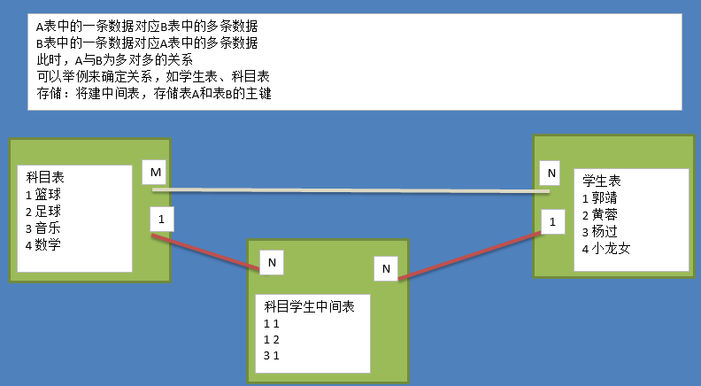

# 学习目标

[TOC]

# 01. 数据库的介绍

好处：

- 持久化存储
- 读写速度极高
- 保证数据的有效性
- 对程序支持性非常好，容易扩展


数据库就是一个由一批分门别类的数据构成的有序集合，这个集合通常被保存为一个或多个彼此相关的文件，

我们可以理解为，数据库就是一种特殊的文件，其中存储着需要的数据。


# 02. 数据库的类型

#### 关系型数据库(RDBMS)

`RDBMS`即关系数据库管理系统(Relational Database Management System)

oracle、mysql、ms sql server、sqlite，db2


关系型数据库：数据库里面的数据全部存在数据表中，而这些表在存储的过程中，各自之间有内在联系。因为这种联系，我们称这样的数据库叫"关系型数据库"


优点：

​	容易理解，二维表结构

​	使用方便，通用的SQL语言使得操作关系型数据库非常方便，便于复杂的查询

​	支持事务等复杂的数据操作功能


#### 非关系型数据库(NoSQL)

NoSQL(NoSQL = Not Only SQL )，意即"不仅仅是SQL"。

MongoDB，Redis

优点：

数据之间无关系，容扩展

结构简单，具有非常高的读写性能，在大数据量下，同样表现优秀

无需事先建立字段，随时可以存储自定义的数据格式


### 02.1 关系型数据库核心元素

- 数据行(记录)
- 数据列(字段)
- 数据表(数据行的集合)
- 数据库(数据表的集合)


例:  一个学生表，(表、字段、列、行)

| 学号 | 姓名 | 性别 |
| ---- | ---- | ---- |
| 1    | 小明 | 男   |
| 2    | 小红 | 女   |
| 3    | 大白 | 男   |
| 4    | 小白 | 男   |


# 03. MySQL的基本介绍

MySQL  是一个关系型数据库管理系统，由瑞典 MySQL AB 公司开发，目前属于 Oracle 旗下公司。MySQL 最流行的关系型数据库管理系统，在 WEB 应用方面 MySQL 是最好的 RDBMS (Relational Database Management System，关系数据库管理系统) 应用软件之一。

MySQL 软件采用了双授权政策（本词条“授权政策”），它分为社区版和商业版，由于其体积小、速度快、总体拥有成本低，尤其是开放源码这一特点，一般网站软件的开发都选择 MySQL 作为网站数据库。


MySQL是一种客户端/服务器端(C/S)的软件，我们要学会如何如何安装服务器端的MySQL,还需要学会如何利用客户端工具操作MySQL数据，常用的客服端工具有： 命令行、pycharm-database、Navicat等


官网：https://www.mysql.com/

下载：https://dev.mysql.com/downloads/windows

services.msc


# 04. 常用入门的操作命令

```
mysql -h127.0.0.1 -uroot -p密码      命令行链接 mysql

status;                   查看数据状态信息

exit、quit               退出数据库连接

show databases;           显示所有的数据库

create database data charset=utf8;      新创建一个数据库

use 数据库名;                 选择要编辑的数据库，例如是data，则语句就是 use data;

select database();        查看当前在哪个数据库下也可以通过status查看

show tables;             展示数据库下所有的表

\c                                     当你输入有误，想重打的时候可以试试加个 \c 取消  

source 数据库文件名.sql;                 导入数据库到mysql中
                                       可以把别人事先创建好的数据库文件导入到当前电脑的mysql中
desc `表名`;                            查看表结构信息
```


键盘的上下键，可以快速滚回我们之前输入的代码。


### SQL

SQL，指结构化查询语言，全称是 Structured Query Language，是一种 ANSI（American National
Standards Institute 美国国家标准化组织）标准的计算机语言，可以让我们可以处理数据库。


SQL语句主要分为：

- **DQL：数据查询语言，用于对数据进行查询，如select**
- **DML：数据操作语言，对数据进行增加、修改、删除，如insert、udpate、delete**
- **DDL：数据定义语言，进行数据库、表的管理等，如create、drop**
- TPL：事务处理语言，对事务进行处理，包括begin transaction、commit、rollback
- DCL：数据控制语言，进行授权与权限回收，如grant、revoke
- CCL：指针控制语言，通过控制指针完成表的操作，如declare cursor


##### 基本书写规则

```
1、每一条语句都要以  ";" 英文分号结尾
2、SQL语句不区分关键字的大小写，但是建议属于SQL语句的关键词语法规则用大写，自建的表名、字段名小写。
3、字符串跟日期类型的值都要以单引号括起来
4、单词之间需要使用半角的空格隔开
5、我们可以通过使用 `` 反引号来括起表名跟字段名，避免跟关键字冲突，但是应该数据库设计就已经避免这个问题了。
```

为了方便接下来的学习，我们先提前准备一个数据库，和数据库相关的数据。

```
create database students charset=utf8mb4;
use students;
# 如果导入的文件不能拖动到终端，就直接下文件的绝对路径。
source D:\yuan\周末2期\day14\素材和资料\student_system.sql 
```


### DQL数据查询语言

##### 查询 SELECT

语法：从指定表中查询所有数据的字段1和字段2信息

​	  select 字段1,字段2 from 表名  

##### 按条件查询数据

只有条件的最终结果为True，才会把数据查询出来

```
select 字段1,字段2 from 表名 WHERE 条件条件;
```

条件语句的语法：

```
字段 运算符 字段值

如果有出现多条件的判断
字段 运算符 字段值 and 字段 运算符 字段值
字段 运算符 字段值 or 字段 运算符 字段值
```

运算符差不多类似于python里面的运算符


```
1、查找学生表的姓名跟年龄
     SELECT name,age FROM student;
   查找课程表中的id,课程名称和教室编号
     select id,course,address from course;
     
2、查找学生表所有的信息【*表示所有字段】
    SELET * FROM student;

3、为字段名设置别名，简化字段名[as可以省略不写，但是必须有英文空格]
    SELECT name AS n,age AS a FROM student;

4、使用条件查询想要的数据,查学号为14的学生姓名[SQL语句中没有==，只有一个=判断两边是否相等]
    SELECT name FROM student WHERE id = 14;
    
  使用条件查询名字叫'吴杰'的学生姓名和年龄
    SELECT name,age FROM student WHERE name='吴杰';

注意：应该根据你的实际需求查询所要的字段值，而不是使用 * ，使用这个效率很低。
```


##### 逻辑运算符

| 运算符 | 含义                                    |
| ------ | --------------------------------------- |
| AND    | 并列，如果组合的条件都是TRUE,返回TRUE   |
| OR     | 或者，如果组合的条件其一是TRUE,返回TRUE |
| NOT    | 取反，如果条件是FALSE,返回TRUE          |

```
1、查询年龄大于18岁小于22岁的学生
      SELECT * FROM student WHERE age<22 AND age>18;
   查询年龄小于19岁 或者 性别是女的学生
      select name,age,description as des from student where age<19 or sex=2;
   查询年龄在18-22之间的女生信息(班级、姓名、年龄和性别)
      select class,name,age,sex from student where age>=18 and age<=22 and sex=2;
   查询309班的所有男生信息(姓名、年龄、个性签名)
	  select name,age,description from student where class=309 and sex=1;
   查询306班、305班、304班的学生信息(姓名、年龄、个性签名)
      select name,age,description from student where class=304 or class=305 or class=306;
```


##### 范围运算符 (BETWEEN...AND... )  

判断字段值是否在指定区间内

```
1、 查询年龄在18-22之间的学生(班级、姓名、年龄和性别)
	SELECT class,name,age,sex FROM student WHERE age BETWEEN 18 AND 22;  
2、 当然，反过来查的话，查询18-22岁以外的学生
    SELECT class,name,age,sex FROM student WHERE NOT age BETWEEN 18 AND 22;
```


##### 比较运算符

| 运算符 | 含义                               |
| ------ | ---------------------------------- |
| =      | 等于，判断字段名的值是否等于指定值 |
| <>、!= | 不等于                             |
| <=     | 小于或等于                         |
| >=     | 大于或等于                         |
| <      | 小于                               |
| >      | 大于                               |

 ```sql
1、查询小于等于19岁的学生
	SELECT *  FROM student WHERE age<=19; 
 ```


##### IN运算符（一个字段多条件值查询）

IN 运算符  允许在 WHERE 子句中规定多个值。

```
1、查询304,305和306班级的学生信息
     select name,class,age from student where class IN (304,305,306);
     
2、查询学号为 1、3、5的学生信息
	SELECT * FROM student WHERE id IN(1,3,5);
```


##### 模糊查询

语法：`字段 Like '%_%'`

LIKE 运算符  允许我们针对只知道部分字符串的情况下，查找所有的字符串，进行模糊查找

   %	匹配任意多个字符   陈%
   _	匹配任意一个字符   陈__

```sql
1、查询姓陈的学生
	SELECT * FROM student WHERE name LIKE '陈%';
   查找名字以风字结尾的学生
    select * from student WHERE name LIKE '%风';

2、查询姓名中带林的学生
   select * from student where name LIKE '%林%';
	 
   查询姓名是4个文字组成的学生
   select * from student where name LIKE '____';
```


##### 聚合运算

AVG		返回指定列的平均值
COUNT	返回指定列中非NULL值的个数
MIN		返回指定列的最小值
MAX		返回指定列的最大值
SUM		返回指定列的所有值之和

聚合运算都是写在select 后面

SELECT COUNT("字段") FROM 表名 WHERE 条件;

```
1、查询305班所有的学生数量
   select COUNT(id) from student where class=305;
   # 上面查询结果中，字段会变成COUNT('id'),可以使用as别名来处理一下。
   select COUNT(id) as c from student where class=305;
   
2、查询所有学生中最小的年龄
   SELECT MIN(age) FROM student;
   
3、查询302班中所有学生的平均年龄。
   select AVG(age) from student where class=302;
```


##### 分组查询

​	GROUP BY子句， 可以对表进行分组，常常与聚合函数一起使用

GROUP BY 字段名，当前这个字段名在表中出现多少个不同的字段值，那么查询结果就会有多少个组。

```sql
1、查询表中有多少男女学生
   SELECT sex,count(sex) FROM student GROUP BY sex;
2、查询学生表中各个年龄段的学生数量
   SELECT age,COUNT(name) FROM student GROUP BY age;
3、查询各个班级的人数各是多少
   select class,COUNT(id) FROM student GROUP BY class;
4、查询年龄段是22,23的人数
   SELECT age,count(id) FROM student where age in (22,23) GROUP BY age;
```


##### 结果排序

order by 子句，对查询结果排序

 ASC表示升序(从小到大)，为默认值，

  DESC为降序(从大到小)

```sql
1、对309班级的学生的年龄进行倒序排序
   select name,age,sex from student where class=309 order by age desc;
```

补充：

结果排序可以多个字段排序

例如：对学生的年龄进行降序排列。

```sql
 select id,name,sex from student order by age desc,id asc;
 
 # 上面就有2个排序的字段，
 # 系统会优先针对 age 进行降序排列，
 # 当age的值一致的时候，系统会按照id进行升序排列。
```


##### 结果限制

LIMIT 子句，可以对查询出的结果进行数量限制，往往我们不想一次取出所有的数据

limit有两个使用方式：

​	  limit后面跟着 一个参数  表示限制结果的数量，例如，limit 5 表示获取5条结果

  	limit后面跟诊 两个参数，第一个参数表示取数据的开始下标[在表中下标从0开始]，第二个参数表示限制结果的数量。

```
SELECT * FROM student LIMIT 3; // 等同于 limit 0,3    # 下标 0,1,2

SELECT * FROM student LIMIT 3,3; // 等同于 limit 3,3  # 下标 3,4,5

SELECT * FROM student LIMIT 6,3; // 等同于 limit 6,3  # 下标 6,7,8
```

```sql
1、查询出年级最大的10个学生
	select * from student order by age desc,id asc limit 10;
2、从所有学生中，查询年级最大的下标从10-19的学生出来。
   	select id,name,age from student order by age desc,id asc limit 10,10;
```


limit 主要用于在项目开发中的分页功能实现。


### DML

##### 添加数据(INSERT )

添加一名记录

```sqlite
INSERT INTO 表名 (字段1,字段2,字段3,....) VALUES (字段值1,字段值2,字段值3,....);

# 也可以省略不写字段名，但是数据的数据项必须和表结构的字段数量保持一致，查询表结构使用 desc 表名;
INSERT INTO 表名 VALUES (字段值1,字段值2,字段值3,....);
```


```
insert into student (id,name,sex,class,age,description) values (101,'刘德华',1,301,17,'给我一杯忘情水~');

# 上面的字段，如果是全部字段，那么字段这一块内容可以省略不写。
# 例如，我们再次添加一个学生，如果省略了字段名，那么填写数据的数据项必须和表结构的字段数量保持一致。
insert into student values (102,'张学友',1,508,17,'爱就像头饿狼~',0,0,0);


添加多名学生
INSERT student(name,sex,class,age,description) VALUES ('周润发',1,508,17,'5个A~'),('周杰伦',1,508,17,'给我一首歌的时间~');


注: 自动增长跟有默认值的字段可以不写。
```


##### 更新数据(UPDATE)

更新必须加上条件，除非有特殊情况。

```sql
UPDATE 表名 SET 字段1=字段值1,字段2=字段值2,..... WHERE 条件
# 更新操作会影响数据的不可逆操作，所以更新的时候，一定要谨慎，添加条件。如果没有条件，
# 或者条件的判断结果一直是True，则整个表所有的记录都会被更新。
```


```
修改id为101的学生的年龄改为18岁。
UPDATE student set age=18 where id=101;
```


##### 删除数据(DELETE)

```sql
DELETE FROM 表名 WHERE 条件  根据指定条件删除数据
DELETE FROM table			删除整个表的内容[没有条件则表示删除整个表所有数据]
```

删除一个学号为103的学生

```
DELETE FROM student WHERE id=103;
# 注: 修改跟删除数据都要记得加条件。
```


**注意**

1. 这里的where用法和上面学习的查询语句里面的where是同一个，所以我们可以删除指定条件的数据，一条或多条都可以。

2. delete删除的仅仅是表的数据，表结构本身还在。

3. mysql中还有一个叫`truncate 表名`用于清空表数据的

   `truncate 表名` 清空现有表中所有的数据，还原到最初建表时的状态。

   `delete from 表名`  删除现有表中所有所有，不会还原表的状态。


### DDL

```
# 创建数据库
create database 数据库名 charset=utf8mb4;

# 删除数据库
drop database 数据库名;

# 删除整个表
DROP TBALE 表名

删除学生表
DROP TABLE student;

# 清空/重置表[表还在数据被清空了]
TRUNCATE 表名; 
```


#### 创建表

```sql
create table 表名(
    字段名1 数据类型 约束规则,
    字段名2 数据类型,
    字段名3 数据类型,
    .....
    字段名N 数据类型,
    PRIMARY KEY(一个 或 多个 字段名)            # 其他的约束规则
);
# 上面语句中，最后一个小句子后面不能有英文逗号出现，前面的小句子必须加上英文逗号。
```

##### 字段名

定义字段名，表名、数据库名的设置规范：

   在64个字符以内，建议简短，如果不够清晰，可以使用前缀。

  不能是关键字或者保留字

   采用变量命名方式[ 由字母、数字、下划线组成，不能以数字开头 ]


##### 数据类型

数据库里面的数据在保存时，也要通过数据类型来告诉系统，这些数据的用途，所以也会有对应的数据类型：

数值类型[整数和浮点数]、字符串 和 日期时间


##### 约束规则

是否唯一[数据在同一个表中的同一列中是否可以出现多个]

是否无符号[约束当前是否可以填写负数，有符号可以填写，无符号不能填写。]

是否设置为当前表的主键[主键是一个表记录不同行数据之间的唯一字段，这个字段必须是唯一的]

是否自动增长[添加数据的时候，如果不填写这个字段，那么这个字段会自动在之前已有的值基础上+1填充]

设置默认值[ 添加/修改数据时，如果值没有填写或者被清空了，采用指定的值作为字段值 ]

是否可以填写空(null，等同于python里面的None)值


创建学生表

```sql
create table student2(
	id    int        unsigned auto_increment primary key comment '主键学号',
	name  char(20) comment '姓名',
	sex   int comment '性别',
	class int comment '班级',
	age   int        unsigned comment '年龄',
	description      varchar(500) null default null
) engine=innodb comment='学生表';

# comment 表示字段注释
```


例如：创建学生表

```sql
mysql> create table student(
    -> id int unsigned auto_increment not null, # 字段名 整型 无符号 自动增长 不能是空,
    -> name char(20),                           # 字段名 字符串(长度：10)
    -> sex int default 1,                       # 字段名 整型 默认值为 1,
    -> class int,                               # 字段名 整型
    -> age int,                                 # 字段名 整型
    -> description text,                        # 字段名 文本[可以填写65535个字符]
    -> primary key(id)                          # 设置主键(id) 每个表必须都有主键
    -> ) engine=innodb charset=utf8;            # 存储引擎=innodb 编码=utf8;[后面学习，先用]
Query OK, 0 rows affected (0.02 sec)            # 出现这句话，表示创建表成功

mysql> desc student; # 显示表结构
+-------------+------------------+------+-----+---------+----------------+
| Field       | Type             | Null | Key | Default | Extra          |
+-------------+------------------+------+-----+---------+----------------+
| id          | int(10) unsigned | NO   | PRI | NULL    | auto_increment |
| name        | char(10)         | YES  |     | NULL    |                |
| sex         | int(11)          | YES  |     | 1       |                |
| class       | int(11)          | YES  |     | NULL    |                |
| age         | int(11)          | YES  |     | NULL    |                |
| description | text             | YES  |     | NULL    |                |
+-------------+------------------+------+-----+---------+----------------+
6 rows in set (0.00 sec)
```

自己动手创建一个课程表

```sql
create table `course`(
    id int unsigned not null auto_increment,
    course char(20) not null,
    lecturer int unsigned,
    address int unsigned,
    primary key(id)
) engine=innodb charset=utf8;
```

数据库操作记录：

```
mysql> create table `course`(
    ->     id int unsigned not null auto_increment,
    ->     course char(20) not null,
    ->     lecturer int unsigned,
    ->     address int unsigned,
    ->     primary key(id)
    -> ) engine=innodb charset=utf8;
Query OK, 0 rows affected (0.01 sec)
```


##### 显示建表语句

```
show create table 表名 \G;
```


```
mysql> show create table course \G;
*************************** 1. row ***************************
       Table: course
Create Table: CREATE TABLE `course` (
  `id` int(10) unsigned NOT NULL AUTO_INCREMENT,
  `course` char(20) NOT NULL,
  `lecturer` int(10) unsigned DEFAULT NULL,
  `address` int(10) unsigned DEFAULT NULL,
  PRIMARY KEY (`id`)
) ENGINE=InnoDB DEFAULT CHARSET=utf8
1 row in set (0.00 sec)
```


修改表-添加字段

```sql
alter table 表名 add 列名 类型;
例：
alter table students add birthday datetime;
```


修改表-修改字段：重命名版

```sql
alter table 表名 change 原名 新名 类型及约束;
例：
alter table students change birthday birth datetime not null;
```


修改表-修改字段：不重命名版

```sql
alter table 表名 modify 列名 类型及约束;
例：
alter table students modify birth date not null;
```


修改表-删除字段

```sql
alter table 表名 drop 列名;
例：
alter table students drop birthday;
```


# 05. 数据类型

了解数据的数据类型可以通过以下语句来查看和使用帮助：

```
mysql> ? 查询关键词

# 如果，我们希望了解关于int的可以填值范围
mysql> ? int
```

使用数据类型的原则：够用就行，尽量使用取值范围小的，而不用大的，这样可以更多的节省存储空间

- 常用数据类型如下：
  - 整数：bit[0-64]，tinyint, smallint, mediumint,bigint
  - 小数：decimal,float,double
  - 字符串：varchar,char,text
  - 日期时间: date, time, datetime
  - 枚举类型(enum) 多选一，例如性别字段 enum('男','女')，后面添加数据时，值得填写只能'男'和'女'这两项,其他值填写进来会报错。
- 特别说明的类型如下：
  - decimal表示浮点数，如decimal(5,2)表示共存5位数，小数占2位
  - char,0-255个字符串,表示固定长度的字符串，如char(3)，如果填充'ab'时会补一个空格为`'ab '`
  - varchar,0-65535, 表示可变长度的字符串，如varchar(3)，填充'ab'时就会存储'ab'
  - 字符串text表示存储大文本，当字符大于4000时推荐使用
  - 对于图片、音频、视频等文件，不存储在数据库中，而是上传到某个文件管理服务器上，然后在表中存储这个文件的保存路径
- 更全的数据类型可以参考<http://blog.csdn.net/anxpp/article/details/51284106>


## 数值类型(常用)

| 类型        | 字节大小 | 有符号范围(Signed)                         | 无符号范围(Unsigned)     |
| ----------- | -------- | ------------------------------------------ | ------------------------ |
| TINYINT     | 1        | -128 ~ 127                                 | 0 ~ 255                  |
| SMALLINT    | 2        | -32768 ~ 32767                             | 0 ~ 65535                |
| MEDIUMINT   | 3        | -8388608 ~ 8388607                         | 0 ~ 16777215             |
| INT/INTEGER | 4        | -2147483648 ~2147483647                    | 0 ~ 4294967295           |
| BIGINT      | 8        | -9223372036854775808 ~ 9223372036854775807 | 0 ~ 18446744073709551615 |


## 小数类型

| 类型         | 使用                                                         | 描述                           |
| ------------ | ------------------------------------------------------------ | ------------------------------ |
| decimal(M,D) | decimal(5,2)，表示只能有5个数字，<br>其中最多设置2个数字在小数点后面<br>可以存储的数值：1000.5，123.56<br>不可以存储的数值：1000.51，100000,  1.345 | 十进制小数，用于表示商品的价格 |
|              |                                                              |                                |
|              |                                                              |                                |


开发中，一般QQ号或者手机号都是使用字符串来保存的


## 字符串

| 类型    | 字节大小 | 示例                                                         |
| ------- | -------- | ------------------------------------------------------------ |
| CHAR    | 0-255    | 定长字符串，类型:char(3) 输入 'ab', 实际存储为'ab ', 输入'abcd' 实际存储为 'abc' |
| VARCHAR | 0-255    | 不定长字符串，类型:varchar(3) 输 'ab',实际存储为'ab', 输入'abcd',实际存储为'abc' |
| TEXT    | 0-65535  | 大文本                                                       |

在5.5版本的mysql以后，varchar类型可以存储的数据，可以达到65535个字符。


## 日期时间类型

| 类型      | 字节大小 | 示例                                                  | 场景                                               |
| --------- | -------- | ----------------------------------------------------- | -------------------------------------------------- |
| DATE      | 4        | '2020-01-01'                                          | 日期记录，会员过期时间，活动时间范围               |
| TIME      | 3        | '12:29:59'                                            | 餐厅的餐牌                                         |
| DATETIME  | 8        | '2020-01-01 12:29:59'                                 | 会员登录时间                                       |
| YEAR      | 1        | '2017'                                                | 电影的年份....                                     |
| TIMESTAMP | 4        | '1970-01-01 00:00:01' UTC ~ '2038-01-01 00:00:01' UTC | 使用频率相对较低,一般使用整型来保存数值型的时间戳. |

DATETIME 和 TIMESTAMP，很多时候，我们会使用程序中的时间戳来代替，后面在数据库中保存时设置字段的类型是数值型，这样的话，可以节省存储空间，同时还可以提高数据的读取速度。


## 约束规则

- 主键primary key：在表中区分每一行数据的唯一性的标志符号，数据在物理上存储的顺序
- 非空not null：此字段不允许填写空值，如果允许填写空值，则直接不填not null
- 惟一unique：此字段的值不允许重复
- 默认default：当不填写此值时会使用默认值，如果填写时以填写为准
- 外键 foreign key：用于连接两个表的关系，对关系字段进行约束，当为关系字段填写值时，会到关联的表中查询时是否此值是否存在，如果存在则填写成功，如果不存在则填写失败并抛出异常
- 说明：虽然外键约束可以保证数据的有效性，但是在进行数据的crud（create增加、update修改、delete删除、read查询）时，都会降低数据库的性能，所以不推荐使用，那么数据的有效性怎么保证呢？答：可以在python的逻辑层进行判断控制[用代码控制]


# 06. 数据库设计

- 关系型数据库建议在E-R模型的基础上，我们需要根据产品经理的设计策划原型，抽取出来模型与关系，制定出表结构，这是项目开始的第一步
- 在开发中有很多设计数据库的软件，常用的如power designer，db desinger等，这些软件可以直观的看到实体及实体间的关系
- 设计数据库，可能是由专门的数据库设计人员完成，也可能是由开发组成员完成，一般是项目经理带领组员来完成
- 现阶段不需要独立完成数据库设计，但是要注意积累一些这方面的经验


## 实体

就是我们根据开发需求，要保存到数据库中作为一张表存在的事物。实体的名称最终会变成表名

实体会有属性，实体的属性就是描述这个事物的内容，实体的属性最终会在表中作为字段存在。

实体与实体之间会存在关系，这种关系一般就是根据三范式提取出来的主外键。


### 三范式

范式理论【在总结了经验以后，得出规范我们数据库设计的一些理论】


```
三范式：
1. 数据要保证不可分割.
2. 数据不能冗余(多余).
3. 数据不能重复.重复的数据,新建一张表存储.
```


- 经过研究和对使用中问题的总结，对于设计数据库提出了一些规范，这些规范被称为范式(Normal Form)

- 目前有迹可寻的共有8种范式，一般需要遵守3范式即可

- ◆ 第一范式（1NF）：强调的是列的原子性，即列不能够再分成其他几列。

  > 考虑这样一个表：【联系人】（姓名，性别，电话） 如果在实际场景中，一个联系人有家庭电话和公司电话，那么这种表结构设计就没有达到 1NF。要符合 1NF 我们只需把列（电话）拆分，即：【联系人】（姓名，性别，家庭电话，公司电话）。1NF 很好辨别，但是 2NF 和 3NF 就容易搞混淆。

- ◆ 第二范式（2NF）：首先是 1NF，另外包含两部分内容，一是表必须有一个主键；二是没有包含在主键中的列必须完全依赖于主键，而不能只依赖于主键的一部分。

  > 考虑一个订单明细表：【OrderDetail】（OrderID，ProductID，UnitPrice，Discount，Quantity，ProductName）。 因为我们知道在一个订单中可以订购多种产品，所以单单一个 OrderID 是不足以成为主键的，主键应该是（OrderID，ProductID）。显而易见 Discount（折扣），Quantity（数量）完全依赖（取决）于主键（OderID，ProductID），而 UnitPrice，ProductName 只依赖于 ProductID。所以 OrderDetail 表不符合 2NF。不符合 2NF 的设计容易产生冗余数据。
  >
  > 可以把【OrderDetail】表拆分为【OrderDetail】（OrderID，ProductID，Discount，Quantity）和【Product】（ProductID，UnitPrice，ProductName）来消除原订单表中UnitPrice，ProductName多次重复的情况。

- ◆ 第三范式（3NF）：首先是 2NF，另外非主键列必须直接依赖于主键，不能存在传递依赖。即不能存在：非主键列 A 依赖于非主键列 B，非主键列 B 依赖于主键的情况。

  > 考虑一个订单表【Order】（OrderID，OrderDate，CustomerID，CustomerName，CustomerAddr，CustomerCity）主键是（OrderID）。 其中 OrderDate，CustomerID，CustomerName，CustomerAddr，CustomerCity 等非主键列都完全依赖于主键（OrderID），所以符合 2NF。不过问题是 CustomerName，CustomerAddr，CustomerCity 直接依赖的是 CustomerID（非主键列），而不是直接依赖于主键，它是通过传递才依赖于主键，所以不符合 3NF。 通过拆分【Order】为【Order】（OrderID，OrderDate，CustomerID）和【Customer】（CustomerID，CustomerName，CustomerAddr，CustomerCity）从而达到 3NF。 *第二范式（2NF）和第三范式（3NF）的概念很容易混淆，区分它们的关键点在于，2NF：非主键列是否完全依赖于主键，还是依赖于主键的一部分；3NF：非主键列是直接依赖于主键，还是直接依赖于非主键列。


## E-R模型

https://www.draw.io/

- E表示entry，实体，设计实体就像定义一个类一样，指定从哪些方面描述对象，一个实体转换为数据库中的一个表
- R表示relationship，关系，关系描述两个实体之间的对应规则，关系的类型包括包括一对一、一对多、多对多
- 关系也是一种数据，需要通过一个字段存储在表中

实体之间会因为引用相互引用字段而存在关系，这种关系一般有三种：

1-1

1-多

n-m[ 多对多一般表现为2个 1对多  ]


- 实体A对实体B为1对1，则在表A或表B中创建一个字段，存储另一个表的主键值


- 实体A对实体B为1对多：在表B中创建一个字段，存储表A的主键值


- 实体A对实体B为多对多：新建一张表C，这个表只有两个字段，一个用于存储A的主键值，一个用于存储B的主键值



- 想一想：举些例子，满足一对一、一对多、多对多的对应关系


#### 逻辑删除

- 对于重要数据，并不希望物理删除，一旦删除，数据无法找回
- 删除方案：设置is_delete的字段列，类型为bit，表示逻辑删除，默认值为0
- 对于非重要数据，可以进行物理删除
- 数据的重要性，要根据实际开发决定


#### 练习

- 设计两张表：班级表、学生表
  - 班级表classes
  - id
  - name
  - isdelete
- 学生表students
  - id
  - name
  - birthday
  - gender
  - clsid
  - isdelete

#### 扩展阅读

- [58到家数据库30条军规解读](http://mp.weixin.qq.com/s/Yjh_fPgrjuhhOZyVtRQ-SA)


#### 消除重复行

- 在select后面列前使用distinct可以消除重复的行

```sql
select distinct 列1,... from 表名;
例：
select distinct gender from students;
```


## where条件的运算符进阶

#### 空判断

- 注意：null与''是不同的
- 判空is null

例13：查询没有填写个性签名的学生

```sql
select * from student where description is null;
```

- 判非空is not null

例14：查询填写了个性签名的学生

```sql
select * from student where description is not null;
```

例15：查询填写了个性签名的男生

```sql
select * from student where description is not null and sex=1;
```


#### 多条件查询的优先级

- 优先级由高到低的顺序为：小括号，not，比较运算符，逻辑运算符
- and比or先运算，如果同时出现并希望先算or，需要结合( )**使用**

例如:

```
# 查询所有年龄18的女生 或者 年龄20的男生
select * from student where (age=18 and sex=2) or (age=20 and sex=1);
```


## 多表查询-连接查询

当查询结果的列来源于多张表时，需要将多张表连接成一个大的数据集，再选择合适的列返回

mysql支持三种类型的连接查询，分别为：

- 内连接查询：查询的结果为两个表匹配到的数据

  

- 右连接查询：查询的结果为两个表匹配到的数据，右表特有的数据，对于左表中不存在的数据使用null填充

  

- [常用]左连接查询：查询的结果为两个表匹配到的数据，左表特有的数据，对于右表中不存在的数据使用null填充

  

#### 语法

```sql
select * from 表1 inner或left或right join 表2 on 表1.列 = 表2.列
```

例1：使用内连接查询id=101的学生信息和成绩

```sql
select name,achievement from student inner join achievement on student.id=achievement.sid where id = 101;
```

此处使用了as为表起别名，目的是编写简单

```sql
select name,achievement from student s
left join achievement a on s.id=a.sid 
where id = 101;
```

例2：使用左连接查询id=101的学生信息和成绩

```sql
select name,achievement from student left join achievement on student.id=achievement.sid where id = 101;
```

例3：使用右连接查询id=101的学生信息和成绩

```sql
select name,achievement from student right join achievement on student.id=achievement.sid where id = 101;
```


## 多表关联

```sql
select 表.字段1,表.字段2,表.字段3..... 
from 主表
left join 从表1 on 主表.主键=从表1.外键 
left join 从表2 on 主表.主键=从表2.外键  
     # 这里和从表2连接的on条件看实际情况，也会出现从表1.主键=从表2.外键的情况
left join 从表3 on 主表.主键=从表3.外键
     # 这里可以是(从表1或从表2).主键=从表2.外键的情况
left join ...
```

#### 多表查询的缺点

多表查询的效率，性能比单表要差。

多表查询以后，还会带来字段多了会引起字段覆盖的情况、

主表student      从表1 achievement   从表2 course

 name                 xxx                              name

上面三张表如果连表，则出现主表的name覆盖从表2的name这种情况。

上面两个问题：

1. 把多表查询语句可以替换成单表查询语句【需要优化的情况】
2. 把重复的字段名，分别使用as来设置成别的名称。


例如，查询白杨的班级、id、年龄和课程名称以及对应课程的成绩

```sql
select a.id,a.class,a.age,b.achievement,c.course 
from student as a
left join achievement as b on a.id=b.sid
left join course as c on c.id=b.cid
where a.name='白杨';
```


练习：

1. 查询刘承志的考试总分.

   ```sql
   select sum(b.achievement) sum   # 有时候as可以不写
   from student as a
   left join achievement as b on a.id=b.sid
   where a.name='刘承志';
   ```

   

2. 查询305班级所有学生的课程名称、课程成绩、以及对应课程的授课老师。

```
1. 先查305的学生信息
2. 再查305的学生成绩
3. 再查305的学生成绩对应的课程
4. 最后查305的学生成绩对应的课程的老师
```

```sql
select a.name,b.achievement,course,d.name
from student as a
left join achievement as b on a.id=b.sid 
left join course as c on b.cid=c.id 
left join lecturer as d on d.id=c.lecturer_id 
where a.class=305;
```

```
上面代码的效果：
+--------+-------------+----------------+--------+
| name   | achievement | course         | name   |
+--------+-------------+----------------+--------+
| 谭季同 |       100.0 | Photoshop      | 唐老师 |
| 谭季同 |        79.0 | 负载均衡       | 杜老师 |
| 谭季同 |        78.5 | Flask项目      | 白老师 |
| 白瀚文 |        73.0 | go             | 陈老师 |
| 白瀚文 |        65.0 | webpy          | 林老师 |
| 白瀚文 |        86.0 | 数据分析       | 郑老师 |
| 白瀚文 |        60.0 | API接口        | 宋老师 |
| 晁然   |         0.0 | Flask          | 陈老师 |
| 晁然   |        78.0 | Python网络编程 | 江老师 |
| 晁然   |        78.0 | HTML5          | 丘老师 |
| 白素欣 |        81.0 | Django项目     | 易老师 |
| 白素欣 |        90.0 | Python         | 黄老师 |
| 白素欣 |        39.0 | Nginx          | 曹老师 |
| 庄晓敏 |        82.5 | Nginx          | 曹老师 |
| 庄晓敏 |        68.0 | Python         | 黄老师 |
| 庄晓敏 |       100.0 | API接口        | 宋老师 |
+--------+-------------+----------------+--------+
```


## 单表的连表查询[自关联查询]

核心就是把一张表看做2张表来操作


```
# 建表：
create table area(
	id smallint not null auto_increment comment '主键ID',
	name char(30) not null comment '地区名称',
	pid smallint not null default 0 comment '父级地区ID',
	primary key (id)
) engine=innodb charset=utf8 comment='行政区划';

insert into area (name,pid) values ('广东',0),('深圳',1),('龙岗',2),('福田',2),('宝安',2);
```

格式：

```sql
select 字段1,字段2...
from 主表(当前表) as a
left join 从表(当前表) as b on a.主键=b.外键
```

查找深圳地区的子地区，SQL代码：

```
# 主表看成保存深圳的表，
# 从表看成保存深圳子地区的表

select b.id,b.name
from area as a
left join area as b on a.id=b.pid
where a.name='深圳';
```


## 子查询

> 在一个 select 语句中,嵌入了另外一个 select 语句, 那么被嵌入的 select 语句称之为子查询语句

格式：

```
select 字段 from 表名 where 条件(另一条查询语句)
```


### 主查询

> 主要查询的对象,第一条 select 语句

### 主查询和子查询的关系

- 子查询是嵌入到主查询中
- 子查询是辅助主查询的,要么充当条件,要么充当数据源
- 子查询是可以独立存在的语句,是一条完整的 select 语句


##### 例如：查询406班上大于平均年龄的学生

使用 子查询：

1. 查询406班学生平均年龄
2. 查询大于平均年龄的学生

查询406班级学生的平均身高

```sql
select name,age from student where age > (select avg(age) as avg from student where class=406) and class=406;

# 复制表
insert student select name,age;
```


## having

```
group by 字段 having 条件；
```

过滤筛选，主要作用类似于where关键字，用于在SQL语句中进行条件判断，过滤结果的。

但是与where不同的地方在于having只能跟在group by 之后使用。


练习：查询301班级大于班上平均成绩的学生成绩信息(name，平均分，班级)。

```sql
# 先求301班的平均成绩
select avg(achievement) as achi from student as a
left join achievement as b on a.id=b.sid 
where class=301;

# 判断301中的每个人平均成绩大于上面的到的平均成绩
select name,avg(achievement) from student as a
left join achievement as b on a.id=b.sid
where class=301 group by name having avg(achievement) > (select avg(achievement) as achi from student as a
left join achievement as b on a.id=b.sid 
where class=301);
```


# select查询语句的完整格式

```sql
select distinct 字段1,字段2....
from 表名 as 表别名
left join 从表1 on 表名.主键=从表1.外键
left join ....
where ....
group by ... having ...
order by ...
limit start,count
```

- 执行顺序为：
  - from 表名[包括连表]
  - where ....
  - group by ...
  - select distinct *
  - having ...
  - order by ...
  - limit start,count
- 实际使用中，只是语句中某些部分的组合，而不是全部


# 备份

- 运行mysqldump命令[使用以下命令必须退出mysql终端]

```sql
mysqldump –uroot –p 数据库名 > python.sql;

# 按提示输入mysql的密码
```


# 恢复

- 连接mysql，创建新的数据库
- 退出连接，执行如下命令

```sql
mysql -uroot –p 新数据库名 < python.sql

# 根据提示输入mysql密码
```


我们之前学习的source也是一种恢复方式，但是两种使用有一个区别。就是

mysql 命令这种方式，可以远程 恢复，而source这种只能本地电脑恢复。

mysql -hIP地址 -uroot -p密码


# Python操作mysql

pymysql  一般使用这个

MySQLDB

### 安装pymysql模块

```shell
pip install pymysql
```


### 使用pymysql模块操作数据库

```python
import pymysql

# from pymysql import *

# 创建和数据库服务器的连接　　connection　
conn = pymysql.connect(host='localhost',port=3306,user='root',password='root123456',
                db='students',charset='utf8')

# 创建游标对象
cursor = conn.cursor()

# 中间可以使用游标完成对数据库的操作
sql = "select * from student;"

# 执行ｓｑｌ语句的函数　　返回值是该ＳＱＬ语句影响的行数
count = cursor.execute(sql)
print("操作影响的行数%d" % count)
# print(cursor.fetchone())   # 返回值类型是元祖，表示一条记录

# 获取本次操作的所有数据
for line in cursor.fetchall():
    print("数据是%s" % str(line))

# 关闭资源　先关游标
cursor.close()
# 再关连接
conn.close()
```


#### 执行语句

```sql
#执行sql，更新单条数据，并返回受影响行数
result = cursor.execute("SQL语句")

#插入多条，并返回受影响的函数，例如批量添加
result2 = cursor.executemany("多条数据")
# 获取最新数据的住建
new_id = cursor.lastrowid
```

#### 获取结果

```python
#获取一行
result1 = cursor.fetchone()
#获取多行[参数可以设置指定返回数量]
result2 = cursor.fetchmany(整型)
#获取所有
result3 = cursor.fetchall()
```

#### 操作数据

```python
#提交，保存新建或修改的数据，如果是查询则不需要
conn.commit() # 写在execute()之后
```


练习：在python中操作pymysql，获取 301班所有女生的信息[id,name,sex,age]

```python

```

