# 笔记

截图工具： https://zh.snipaste.com/

## django框架

官方网站:https://www.djangoproject.com/

中文文档:https://docs.djangoproject.com/zh-hans/2.2/

程序版本号声明规则:  大版本.小版本.修订号

大版本: 内核核心功能已经修改代码.

小版本: 增加/删除功能

修订号: bug, 补丁, 不涉及功能的增加或删除.

最新版本:2.2

分两种不同的发行版本:  LTS[ long-time support ] 长线支持版本

​                                          发行版本[普通版本]: 


## 0.0 虚拟环境virtualenv

```text
作用: 让开发人员可以在一台机子中一个模块包的多个不同版本.
例如: 可以安装多个不同版本的django框架, 他们之间被虚拟环境隔离开来.

虚拟环境本质就是一个保存python的目录,当我们安装使用了虚拟环境,那么我们切换不同虚拟环境的时候,程序中引用的python模块也就不一样了.

虚拟虚拟环境只会针对通过pip安装下载的包/模块起作用,其他的文件/代码是不会被虚拟环境影响到的.
```


如果在一台电脑上, 想开发多个不同的项目, 需要用到同一个包的不同版本, 如果直接使用安装包的命令, 在同一个目录下安装或者更新, 新版本会覆盖以前的版本, 其它的项目就无法运行了.而公司里面往往会存在多个项目的情况，所以需要使用虚拟环境，把当前项目所需要用到的模块及其版本进行隔离包装到一个虚拟环境中使用。


### 0.0.1 安装虚拟环境管理器

```bash
pip install virtualenv             
pip install virtualenv-clone       
pip install virtualenvwrapper
pip install virtualenvwrapper-win

# 注意以上命令适用于window系统
```

### 0.0.2 常用命令

```bash
查看所有虚拟环境：            workon+2次tab键
创建虚拟环境：                mkvirtualenv 虚拟环境名称
创建虚拟环境(指定python版本)： mkvirtualenv -p python 虚拟环境名称
使用虚拟环境：               workon 虚拟环境名称
退出虚拟环境：               deactivate
删除虚拟环境（必须先退出虚拟环境内部才能删除当前虚拟环境）:
                           	rmvirtualenv 虚拟环境名称
    
其他相关命令：
查看虚拟环境中安装的包：              pip freeze  或者 pip list
收集当前环境中安装的包及其版本：       pip freeze > requirements.txt
在部署项目的服务器中安装项目使用的模块： pip install -r requirements.txt
```

提示:

- 虚拟环境只会管理环境内部的模块和python解析器,对于源代码或者其他文件是毫无关系

- 创建虚拟环境需要联网
- 创建成功后, 会自动工作在这个虚拟环境上
- 工作在虚拟环境上, 提示符最前面会出现 “(虚拟环境名称)”


如果在创建虚拟环境时无法安装，一般就是权限问题导致失败

解决方案：添加系统环境变量，修改默认的虚拟环境保存目录

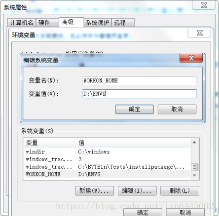


## 01-创建Django项目

1. 安装虚拟环境：

```bash
mkvirtualenv django_demo -p python3
```

2. 安装django安装包(联网安装)：

```bash
pip install django
```

3. 创建django工程（项目）：

```bash
django-admin startproject 项目名称[目录名称]
例如：
django-admin startproject djangodemo
```


第一次创建项目以后的目录结构：

```text
├── djangodemo/          主应用目录[官方建议把项目相关的代码存放在这里]
│   ├── __init__.py      项目初始化文件[一般用不上]
│   ├── settings.py      项目核心配置文件
│   ├── urls.py          总路由
│   └── wsgi.py          web服务器的核心调用文件
└── manage.py   # 命令行管理项目的工具[脚手架工具]
```

进入项目根目录，通过mange.py启动django项目。

```bash
cd djangodemo
python manage.py runserver
# python manage.py runserver  域名IP:端口
```


## 01.2-使用pycharm管理项目

打开项目

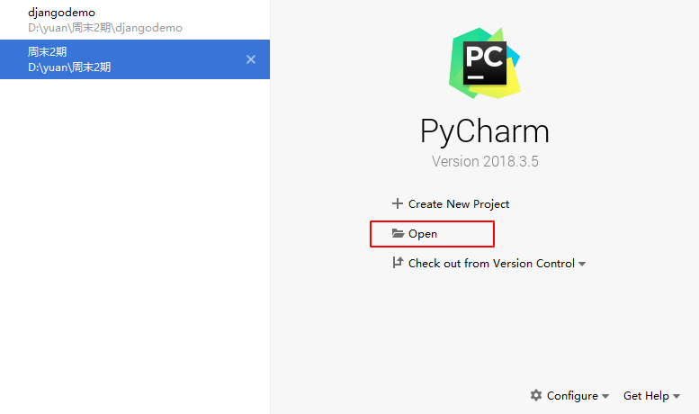


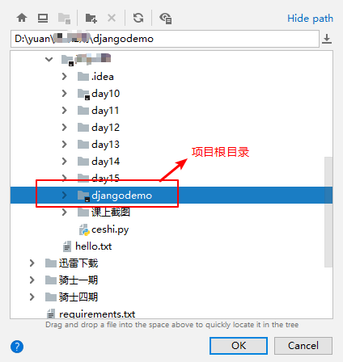


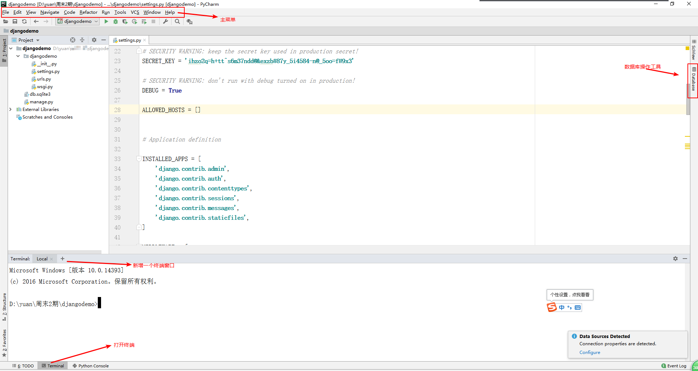

然后给当前项目设置虚拟环境

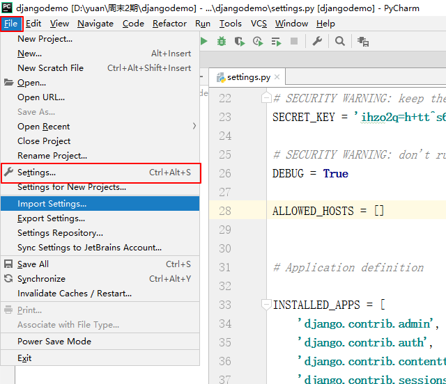

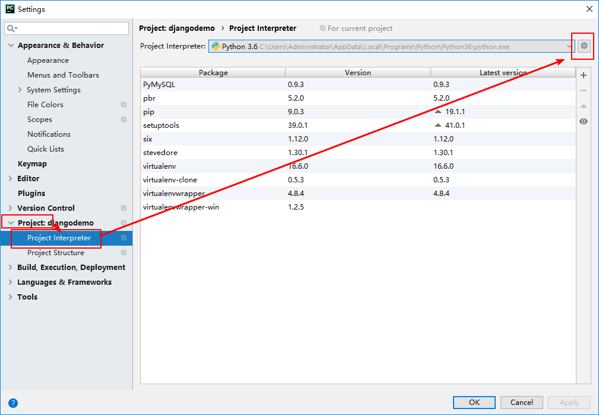


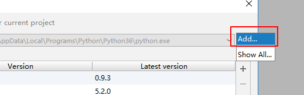


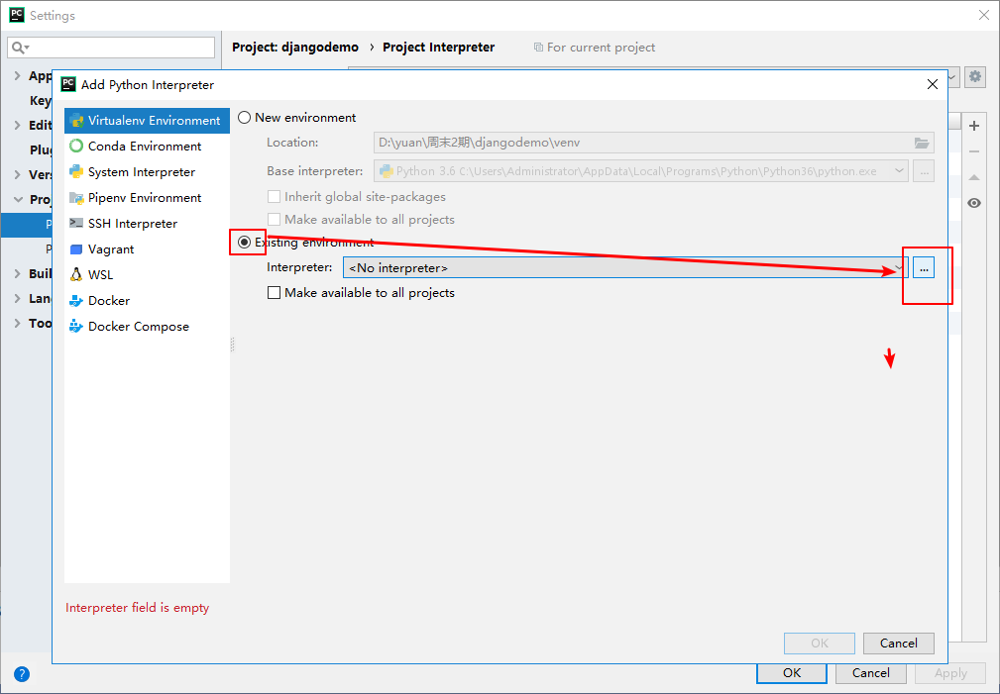

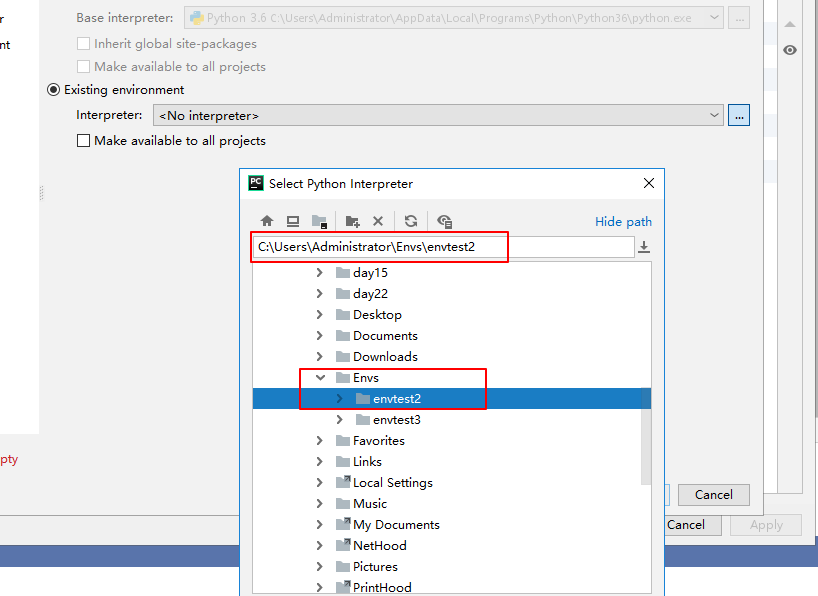


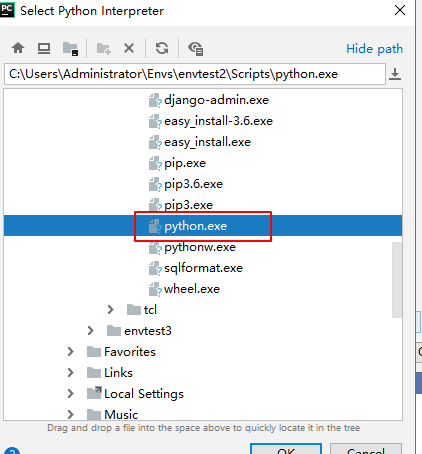


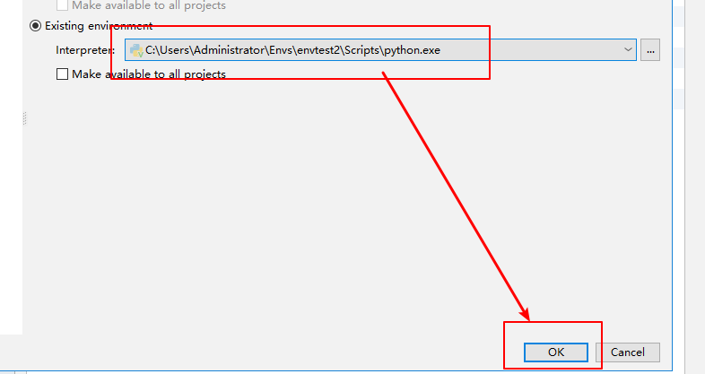


完成上面的操作步骤就可以直接在pycharm中把项目运行在我们指定的虚拟环境中了。

打开manage.py文件，运行当前文件。

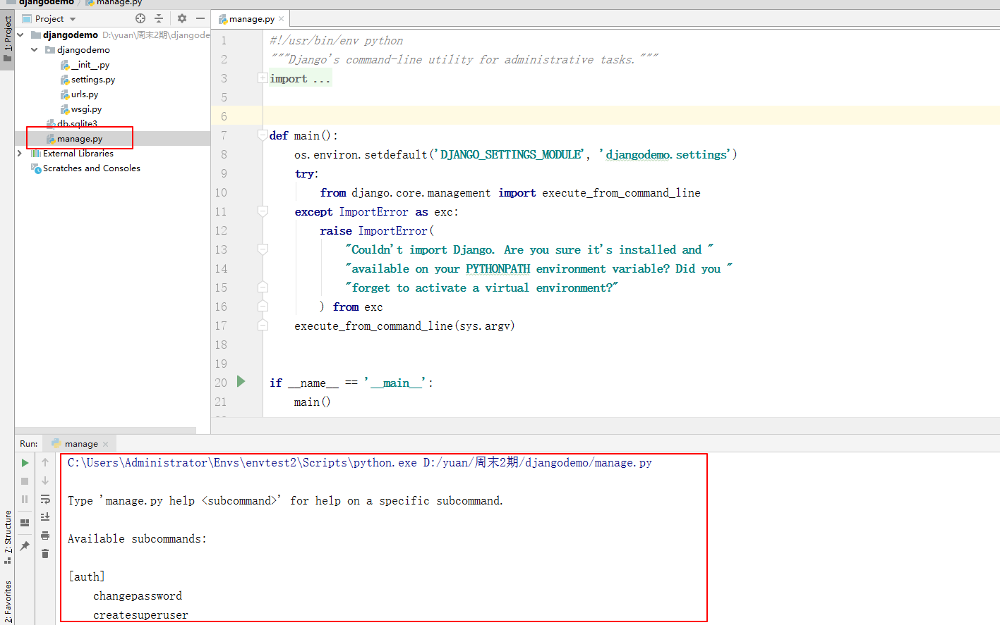

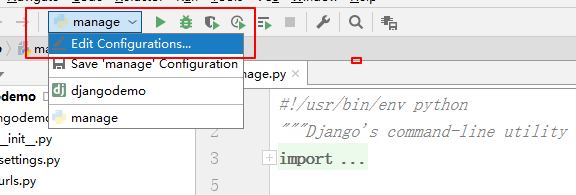


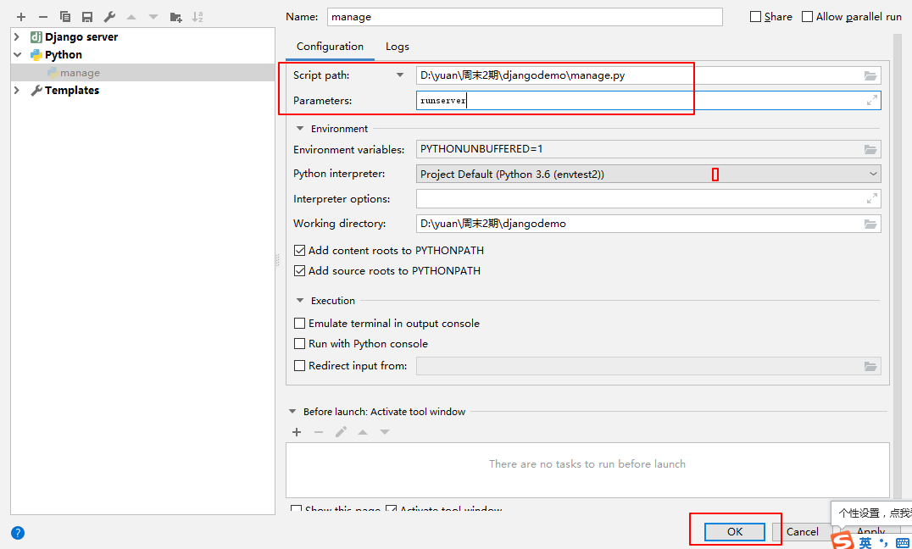


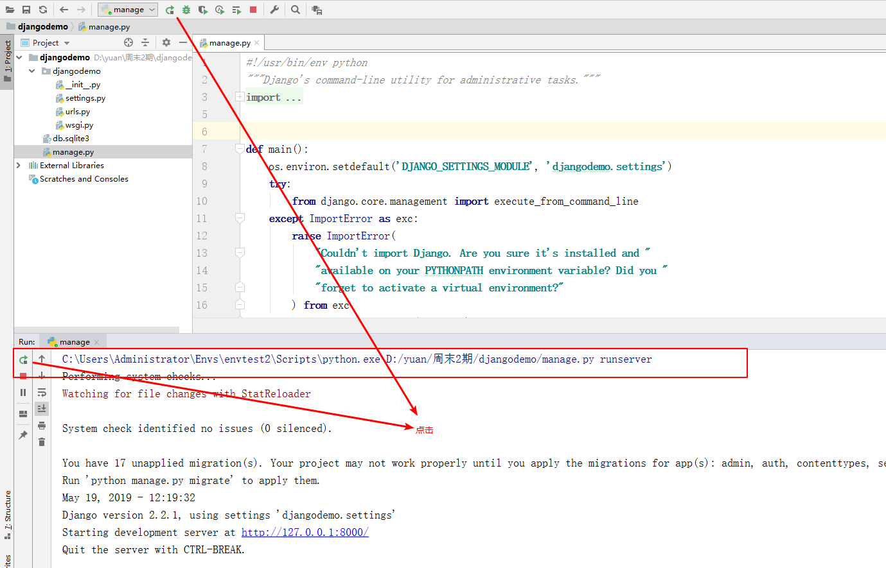


## 02. 创建子应用

```bash
python manage.py startapp 子应用目录
```

例如，把我们之前数据库操作的students作为子应用创建出来

```bash
python manage.py startapp students
```


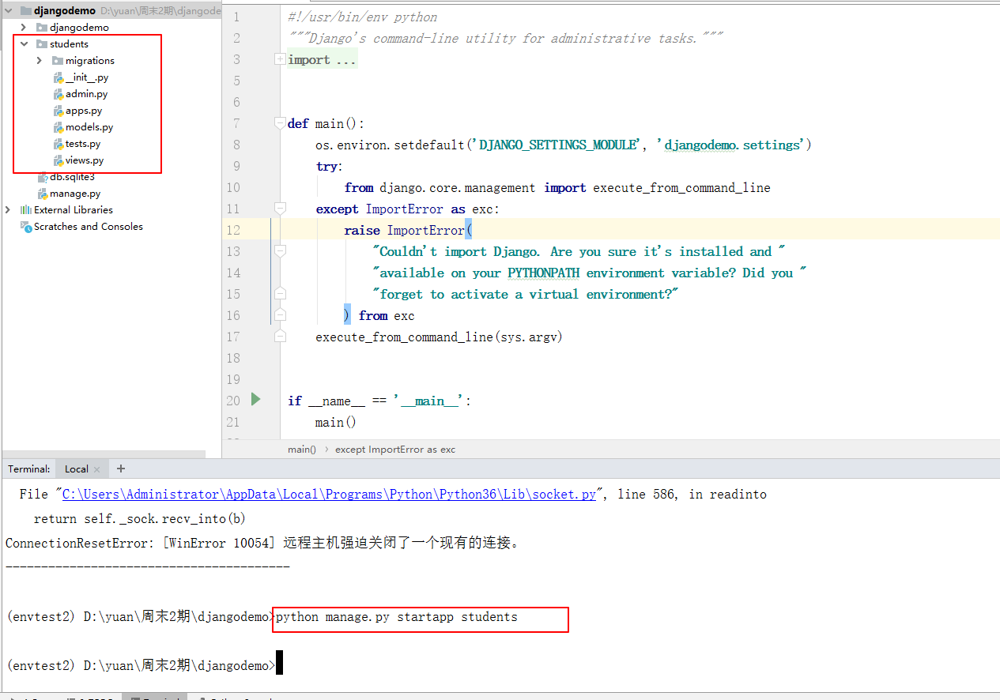


安装子应用之前需要了解项目的整个目录。

```python
migrations/  用于存放数据库迁移历史文件。[django提供通过代码的方式创建表结构，同步到数据库]
admin.py 文件跟网站的后台管理站点配置相关。
apps.py 文件用于配置当前子应用的相关信息。
models.py 文件用户保存数据库模型类。
tests.py 文件用于开发测试用例，编写单元测试。
views.py 文件用于编写Web应用视图。
```

安装子应用打开项目的配置文件，settings.py。找到INSTALLED_APPS配置项：

```python

INSTALLED_APPS = [
    'django.contrib.admin', # admin站点管理后台
    'django.contrib.auth',  # 用户认证模块
    'django.contrib.contenttypes',  # 数据库的关系管理
    'django.contrib.sessions',      # session模块
    'django.contrib.messages',      # 消息模块[针对错误提示，运行提醒]
    'django.contrib.staticfiles',   # 静态文件管理[ css/js/html ]

    'students',
]
```


## 03-创建视图

1. 在子应用的视图文件views.py中，编写视图函数，例如：

   ```python
   from django.shortcuts import render
   from django.http import HttpResponse
   # Create your views here.
   def index(request):
   	return HttpResponse("<h1>hello django</h1>")
   
   
   def list(reuqest):
   	return HttpResponse("列表页")
   
   ```

2. 视图创建完成以后，需要指定路由，用户才能访问到视图中的内容。

   2.1 在子应用目录下创建当前子应用所属的路由文件urls.py，编写代码如下：

   ```python
   from django.urls import path
   from . import views
   urlpatterns = [
   	# path("访问url地址", 视图函数名)
   	path("index/", views.index ), # 为了防止用户访问出错,我们强烈建议每次声明路由访问地址,以 / 斜杠结尾
   	path("index/abc", views.list ),
   ]
   ```

   2.2 在项目的主应用djangodemo下的urls.py总路由文件中，加载子应用的路由文件所有路由。

   ```python
   """djangodemo URL Configuration
   
   The `urlpatterns` list routes URLs to views. For more information please see:
       https://docs.djangoproject.com/en/2.2/topics/http/urls/
   Examples:
   Function views
       1. Add an import:  from my_app import views
       2. Add a URL to urlpatterns:  path('', views.home, name='home')
   Class-based views
       1. Add an import:  from other_app.views import Home
       2. Add a URL to urlpatterns:  path('', Home.as_view(), name='home')
   Including another URLconf
       1. Import the include() function: from django.urls import include, path
       2. Add a URL to urlpatterns:  path('blog/', include('blog.urls'))
   """
   from django.contrib import admin
   from django.urls import path,include
   
   urlpatterns = [
       path('admin/', admin.site.urls),
       path("home/", include("students.urls") ),
   ]
   
   ```

访问视图时，完整的访问路径，是有两部分组成：

```python
主应用的url地址 + 子应用的url地址
"home/" + "list/"   ==>      home/list/
```


## 04-配置文件

在主应用目录下的settings.py，是django 项目的核心配置文件。

```python
"""
Django settings for django_demo project.

Generated by 'django-admin startproject' using Django 1.11.11.

For more information on this file, see
https://docs.djangoproject.com/en/1.11/topics/settings/

For the full list of settings and their values, see
https://docs.djangoproject.com/en/1.11/ref/settings/
"""

import os

# Build paths inside the project like this: os.path.join(BASE_DIR, ...)
# 根目录
# 定义变量 获取项目根目录
BASE_DIR = os.path.dirname(os.path.dirname(os.path.abspath(__file__)))


# Quick-start development settings - unsuitable for production
# See https://docs.djangoproject.com/en/1.11/howto/deployment/checklist/

# SECURITY WARNING: keep the secret key used in production secret!
# 秘钥
# hashlib.md5("用户原文密码"+"密钥")
SECRET_KEY = 'u319rt09av$^zblh^%*913jl_4q-je@%7s4-k2+@8b7#rx$tfh'

# SECURITY WARNING: don't run with debug turned on in production!
# 开启调试模式
# 注意：项目上线时候，需要设置debug为false，防止泄露过多的信息
DEBUG = True

# 在DEBUG=False,就需要设置允许哪些客户端访问可以访问到项目
ALLOWED_HOSTS = []
# ALLOWED_HOSTS = ["*"]  # 当DEBUG=False的时候，需要设置这个，允许所有访问


# Application definition
# 安装子应用
INSTALLED_APPS = [
    'django.contrib.admin',
    'django.contrib.auth',
    'django.contrib.contenttypes',
    'django.contrib.sessions',
    'django.contrib.messages',
    'django.contrib.staticfiles',
    
    # 注册自己的子应用
    'students',
]

# 中间件/全局钩子
# 应用场景：加密，安全检测，session，csfr，权限，消息读取
MIDDLEWARE = [
    'django.middleware.security.SecurityMiddleware',
    'django.contrib.sessions.middleware.SessionMiddleware',
    'django.middleware.common.CommonMiddleware',
    'django.middleware.csrf.CsrfViewMiddleware',
    'django.contrib.auth.middleware.AuthenticationMiddleware',
    'django.contrib.messages.middleware.MessageMiddleware',
    'django.middleware.clickjacking.XFrameOptionsMiddleware',
]
# 项目的总路由文件
ROOT_URLCONF = 'djangodemo.urls'

# 视图模板的配置信息
TEMPLATES = [
    {
        'BACKEND': 'django.template.backends.django.DjangoTemplates',
        'DIRS': [],
        'APP_DIRS': True,
        'OPTIONS': {
            'context_processors': [
                'django.template.context_processors.debug',
                'django.template.context_processors.request',
                'django.contrib.auth.context_processors.auth',
                'django.contrib.messages.context_processors.messages',
            ],
        },
    },
]
# http服务器类
WSGI_APPLICATION = 'django_demo.wsgi.application'


# Database
# https://docs.djangoproject.com/en/1.11/ref/settings/#databases
# 数据库
DATABASES = {
    'default': {
        'ENGINE': 'django.db.backends.sqlite3',
        'NAME': os.path.join(BASE_DIR, 'db.sqlite3'),
    }
}


# Password validation
# https://docs.djangoproject.com/en/1.11/ref/settings/#auth-password-validators
# django默认提供了用户管理管理功能,用户管理里面内置了用户的验证功能
AUTH_PASSWORD_VALIDATORS = [
    {
        'NAME': 'django.contrib.auth.password_validation.UserAttributeSimilarityValidator',
    },
    {
        'NAME': 'django.contrib.auth.password_validation.MinimumLengthValidator',
    },
    {
        'NAME': 'django.contrib.auth.password_validation.CommonPasswordValidator',
    },
    {
        'NAME': 'django.contrib.auth.password_validation.NumericPasswordValidator',
    },
]


# Internationalization
# https://docs.djangoproject.com/en/1.11/topics/i18n/
# 设置项目的默认语言
LANGUAGE_CODE = 'en-us'
# 设置项目的默认时区
TIME_ZONE = 'UTC'

USE_I18N = True

USE_L10N = True

USE_TZ = True


# Static files (CSS, JavaScript, Images)
# https://docs.djangoproject.com/en/1.11/howto/static-files/
# 静态资源访问url路径[图片/js/css路径]
STATIC_URL = '/static/'
```


访问静态资源与项目的路由无关，是在settings的STATICFILES_DIRS和STATIS_URL里面单独进行配置的。


## 05-设置静态资源

1. 在项目配置文件中STATIC_URL下面添加一个配置项`STATICFILES_DIRS和STATIS_URL`，代码：

   ```python
   # 静态资源实际存储目录,可以有多个,这样设置的好处,可以把不同地方的静态资源进行存储
   STATIC_URL = '/static/'
   STATICFILES_DIRS = [
       os.path.join(BASE_DIR, 'statics'),
   ]
   ```

2. 在项目根目录下创建指定名称的自定义目录名`static`(上面配置项中指定的)。

   ```
   项目根目录/
   ├── django_demo/
   │   ├── __init__.py
   │   ├── settings.py
   │   ├── urls.py
   │   └── wsgi.py
   ├── manage.py
   ├── statics/             # 项目静态资源目录
       └── avatars/
            └── 3.jpg
   
   ```

3. 启动项目，访问项目的静态资源dog.png

   `http://127.0.0.1/static/avatars/3.jpg`

   效果：

   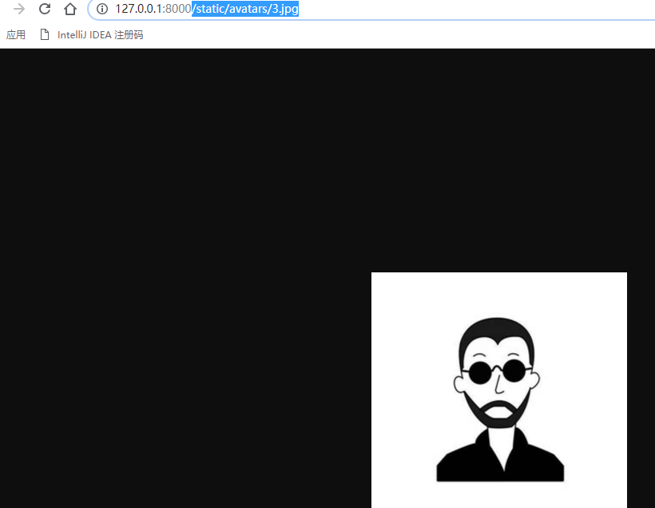

同样,在代码中要显示图片,代码:

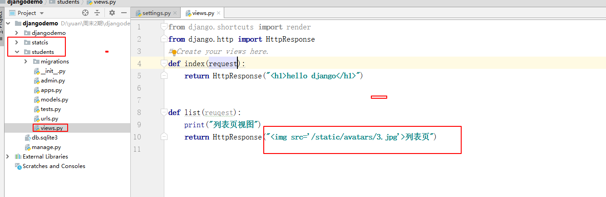

效果:

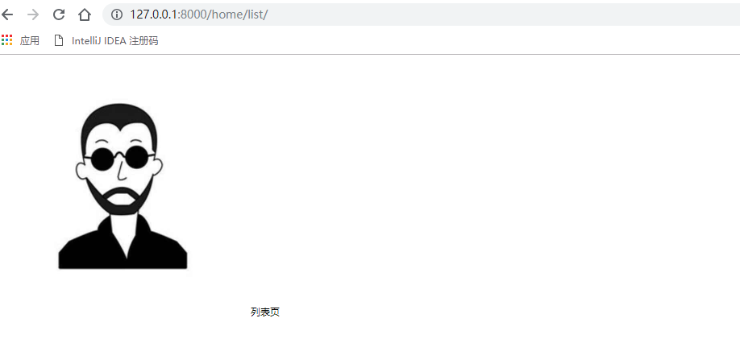


## 06-路由

用户访问视图的路由地址 = 总路由的前半段路由+子应用的后半段路由

总结：

Django路由解析匹配的顺序，django先读取主应用[djangodemo]下面的urls.py总路由文件中的路由代码，然后总路由中如果有include函数，则自动帮我们根据include中指定的路径访问子应用下的urls路由文件中。

最终访问视图函数的路由地址：

```
http://127.0.0.1:8000/总路由文件中的路由前缀/子应用路由文件中的路由地址


主应用中的路由书写规范必须要是：
urlpatterns=[
	path("路由前缀", include("子应用的目录名.urls")),	
]

子应用的路由书写规范必须要是：
urlpatterns=[
	path("路由地址",视图函数);
]
```


路由就是在接收客户端请求以后，分析请求中的路径，到urls中进行正则的匹配，然后把客户端请求转发给匹配到的视图函数中。【 完成了客户端访问路径和web项目中的应用程序（视图）的 一 一 绑定关系 】

django本身执行视图的顺序是先找到路由，根据路由地址找到视图。

在路由中路由地址有两种声明方式，分别通过path和re_path来进行声明。

#### 06.1-path

path是不支持编写正则的路由地址，

路由代码：

```python
from django.urls import path  # 不支持使用正则
from . import views
urlpatterns = [
	# path("访问url地址", 视图函数名)
	path("index/", views.index ), # 为了防止用户访问出错,我们强烈建议每次声明路由访问地址,以 / 斜杠结尾
]
```

视图代码：

```python
from django.http import HttpResponse
# Create your views here.
def index(request):
	return HttpResponse("<h1>hello django</h1>")
```


#### 06.2-re_path

re_path支持使用正则提取路由地址中的数据

编写正则路由的时候，必须给正则声明开始位置(**^**)和结束位置(**$**)

路由代码：

```python
from django.urls import re_path  # 需要使用正则
from . import views
urlpatterns = [
	# re_path("^路由地址$", 视图函数名)
	re_path("^list/$",views.list),
	re_path("^list/(?P<mobile>\d{11})/$", views.list2 ),
    re_path("^list/(?P<cat>\d+)/(?P<pn>\d+)/$", views.list3),
]
```

视图代码：

```python
from django.http import HttpResponse
# Create your views here.
def list(reuqest):
	print("列表页1视图")
	return HttpResponse("列表页2")

def list2(reuqest,mobile):
	print("列表页2视图")
	return HttpResponse("手机号：%s<br> 列表页" % mobile)

# 可以接受多个参数，不仅是一两个。
def list3(request,cat,pn):
	return HttpResponse("cat=%s pn=%s" % (cat,pn) )
```


反解析：就是在视图中通过路由的命名空间和路由的别名获取对应的路由地址，和上面的顺序相反。

## 06.1-路由反解析

reverse()是一个函数，可以帮我们自动获取视图函数对应的路由地址。

#### reverse反解析分三个步骤：

1. 需要在总路由文件中，给对应的子应用目录声明命名空间，作用是：<mark>区分路由和修改路由的时候不需要再修视图中使用到的路由地址</mark>。

   ```
   path("home/",include("students.urls",namespace="home") ),
   ```

2. 需要在子应用路由文件中， 给对应视图的路由地址（后半段）声明别名，作用是：区分路由，避免重复

   ```
   path("index/",views.index,name="index"),
   ```

3. 在视图中使用reverse必须完成前面两个步骤。

   ```python
   from django.http import HttpResponse
   from django.urls import reverse
   app_name="home"  # 这里的名称必须和上面的总路由中声明的namespace一致.
   def index(request):
   	return HttpResponse("<h1>hello django</h1>")
   
   
   def list(reuqest):
   	print("列表页1视图")
   	return HttpResponse("<a href='%s'>首页</a>列表页2" % reverse("home:index") )
   ```

上面的步骤完成，访问效果：

效果： 

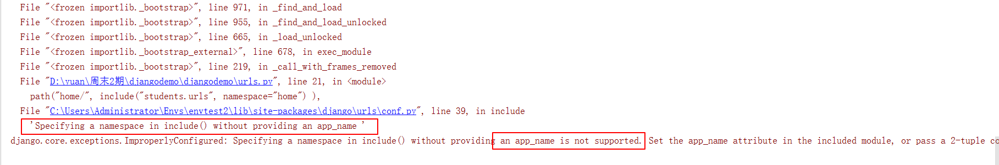


## 07-请求

request有提供了5种方式给我们获取客户端发送过来的数据

#### 07.1-提取URL的特定部分

两个简便的方式可以完成：

+ 未命名参数

  路由文件中通过正则的小括号提取需要的路由信息：

  ```python
  from django.urls import re_path
  re_path(r"^list2/(\d+)/([a-z]+)$",views.list4 ),
  ```

  视图函数中request参数后面新增对应数量的形参用于接收数据

  ```python
  def list4(request,num, city):
  	return HttpResponse("num=%s<br>city=%s" % (num,city))
  ```

  访问：http://127.0.0.1:8000/home/list/11/guangzhou

  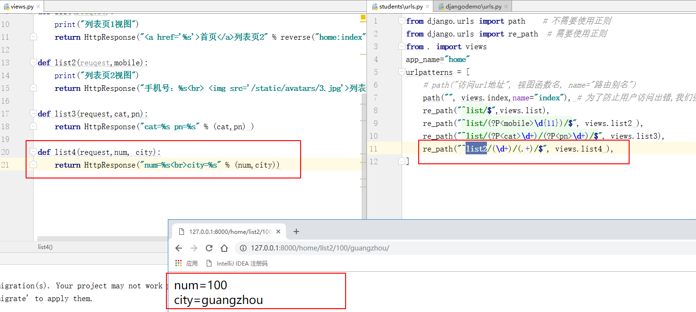

  

+ 命名参数

  在未命名参数 的左边圆括号后面加上?P<参数名称>.

```
from django.urls import re_path
re_path(r"^list/(?p<num>\d+)/(?p<city>[a-z]+)$",views.list2 ),
```

​	在视图中获取命名参数

```python
def list2(request,num, city):
	return HttpResponse("num=%s<br>city=%s" % (num,city))
```


#### 07.2-查询字符串（query string)

+ request.GET.get() 获取单个查询字符串的参数 ，支持两种写法。

  ```python
  username = request.GET.get("name") # 如果参数不存在，可以设置get的第二个参数为默认值。
  age = request.GET["name"]  # 如果参数名称不存在,则报错
  ```

  <form action="/req3?age=21" method="post">

+ request.GET.getlist() 获取多个查询字符串的参数

  ```python
  del = request.GET.getlist("del")  # 以列表的方式获取指定名称参数的所有值，get只能获取最后一个。
  ```


#### 07.3-请求体（body）

+ 表单类型数据，只能获取method="post"的数据

  ```
  request.POST.get("表单项的name值")  # 获取一个值
  request.POST.getlist("表单项的name值") # 获取多个值
  ```

+ 非表单类型数据[ajax]

  ```python
  def detail3(request):
  	"""获取请求内容[其他格式内容]"""
  	# 其他格式数据: json/xml
  	print(request.body)
  	# request.body接受到数据，是bytes类型的数据
  	# b'{\n\t"username": "xiaoming",\n\t"age":32,\n\t"achievement": 13.5,\n\t"son":{\n\t\t"username":"xiaoxiaoming",\n\t\t"age":12\n\t},\n\t"love":["\xe6\xb8\xb8\xe6\x88\x8f","\xe6\xb8\xb8\xe6\xb3\xb3"]\n}'
  	# 我们需要手动对请求体中的数据进行识别转换
  	data_str = request.body.decode()
  	print(data_str)
  	print(type(data_str)) # <class 'str'>
  	import json
  	data_dict = json.loads(data_str)
  	print(data_dict)
  	print(type(data_dict)) # <class 'dict'>
  	return HttpResponse("获取请求内容")
  ```


#### 07.4-请求头信息（header）

+ 自定义请求头信息

  request.META["HTTP_名称大写"]


#### 07.5-其他的request请求信息

+ request.method

+ request.user

+ request.FILES


## 08-响应

#### 08.1-内容响应

+ 响应html文本信息

  ```python
  HttpResponse(content="响应内容",content_type="内容类型，常见的有application/json,text/text",status="状态码,常见的有：404,200,201,204")
  
  # 还可以设置响应的响应头信息
  response = HttpResponse()
  response["company"] = "我的公司"
  return response
  ```

+ 响应其他信息[json]

```python
# 把字典数据响应成json格式数据
dict1 = {
  "name":"xiaobai",
  "age":21
}

# return HttpResponse(str(dict1),content_type="application/json")
return JsonResponse(dict1)

# 如果要响应的数据格式是列表.
list2 = ["xiaoming","xiaohei"]
return JsonResponse(list2)
```


#### 08.2-页面跳转

也叫页面重定向。

```python
# shortcuts 简写函数库
from django.shortcuts import redirect
def res2(request):
	"""页面重定向响应"""
	# return redirect("http://www.baidu.com")

	# redirect 其实本质上就是 HttpResponse的简写操作,以下是还原代码:
	response = HttpResponse(status=302)
	response["Location"] = "http://www.baidu.com"
	return response
```


## 扩展内容

前后端传递数据时，数据的格式可以是html文本格式，json格式，xml格式。当然不同平台，不同的编程语言也是如此。

+ 文本格式：

  ```text
  username=小明&password=123456
  ```

+ json格式：

  ```json
  {
      "username":"小明",
      "password":"123456",
      "sex":"女"
  }
  ```

+ xml格式：

  xml格式类似于html，也是采用标签来表达数据的，但是不一样的是，xml的所有标签都需要开发者自定义。

  现在使用这种格式的公司很少了。

  ```
  <xml version="1.0" charset="utf-8">
  	<username>小明</username>
  	<password>123456</password>
  	<sex>女</sex>
  </xml>
  ```


