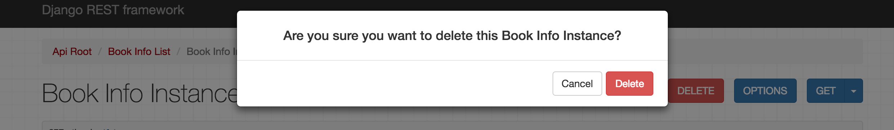

#  1. Web应用模式

在开发Web应用中，有两种应用模式：

1. 前后端不分离


2. 前后端分离


# 2. api接口

为了在团队内部形成共识、防止个人习惯差异引起的混乱，我们需要找到一种大家都觉得很好的接口实现规范，而且这种规范能够让后端写的接口，用途一目了然，减少双方之间的合作成本。

目前市面上大部分公司开发人员使用的接口服务架构主要有：restful、rpc。

SOAP

**rpc**: 翻译成中文:远程过程调用[远程服务调用].

http://www.lufei.com/api

post请求

action=get_all_student&params=301&sex=1

接口多了,对应函数名和参数就多了,前端在请求api接口时,就会比较难找.容易出现重复的接口


**restful**: 翻译成中文: 资源状态转换.

把后端所有的数据/文件都看成资源. 

那么接口请求数据,本质上来说就是对资源的操作了.

web项目中操作资源,无非就是增删查改.所以要求在地址栏中声明要操作的资源是什么,然后通过http请求动词来说明对资源进行哪一种操作.

POST http://www.lufei.com/api/students/   添加数据

GET    http://www.lufei.com/api/students/   获取所有学生


# 3. RESTful API规范


REST全称是Representational State Transfer，中文意思是表述（编者注：通常译为表征）性状态转移。 它首次出现在2000年Roy Fielding的博士论文中。

RESTful是一种定义Web API接口的设计风格，尤其适用于前后端分离的应用模式中。

这种风格的理念认为后端开发任务就是提供数据的，对外提供的是数据资源的访问接口，所以在定义接口时，客户端访问的URL路径就表示这种要操作的数据资源。

而对于数据资源分别使用POST、DELETE、GET、UPDATE等请求动作来表达对数据的增删查改。

| 请求方法 | 请求地址    | 后端操作          |
| -------- | ----------- | ----------------- |
| GET      | /students   | 获取所有学生      |
| POST     | /students   | 增加学生          |
| GET      | /students/1 | 获取编号为1的学生 |
| PUT      | /students/1 | 修改编号为1的学生 |
| DELETE   | /students/1 | 删除编号为1的学生 |


事实上，我们可以使用任何一个框架都可以实现符合restful规范的API接口。

参考文档：http://www.runoob.com/w3cnote/restful-architecture.html


# 4. 序列化

api接口开发，最核心最常见的一个过程就是序列化，所谓序列化就是把**数据转换格式**，序列化可以分两个阶段：

**序列化**： 把我们识别的数据转换成指定的格式提供给别人。

例如：我们在django中获取到的数据默认是模型对象，但是模型对象数据无法直接提供给前端或别的平台使用，所以我们需要把数据进行序列化，变成字符串或者json数据，提供给别人。

**反序列化**：把别人提供的数据转换/还原成我们需要的格式。

例如：前端js提供过来的json数据，对于python而言就是字符串，我们需要进行反序列化换成模型类对象，这样我们才能把数据保存到数据库中。


# 5. Django Rest_Framework

核心思想: 缩减编写api接口的代码

Django REST framework是一个建立在Django基础之上的Web 应用开发框架，可以快速的开发REST API接口应用。在REST framework中，提供了序列化器Serializer的定义，可以帮助我们简化序列化与反序列化的过程，不仅如此，还提供丰富的类视图、扩展类、视图集来简化视图的编写工作。REST framework还提供了认证、权限、限流、过滤、分页、接口文档等功能支持。REST framework提供了一个API 的Web可视化界面来方便查看测试接口。


中文文档：https://q1mi.github.io/Django-REST-framework-documentation/#django-rest-framework

github: https://github.com/encode/django-rest-framework/tree/master

### 特点

- 提供了定义序列化器Serializer的方法，可以快速根据 Django ORM 或者其它库自动序列化/反序列化；
- 提供了丰富的类视图、Mixin扩展类，简化视图的编写；
- 丰富的定制层级：函数视图、类视图、视图集合到自动生成 API，满足各种需要；
- 多种身份认证和权限认证方式的支持；[jwt和OAuth2.0]
- 内置了限流系统；
- 直观的 API web 界面；
- 可扩展性，插件丰富


# 6. 环境安装与配置

DRF需要以下依赖：

- Python (2.7, 3.2, 3.3, 3.4, 3.5, 3.6)
- Django (1.10, 1.11, 2.0)

**DRF是以Django扩展应用的方式提供的，所以我们可以直接利用已有的Django环境而无需从新创建。（若没有Django环境，需要先创建环境安装Django）**


## 6.1 安装DRF

```python
mkvirtualenv drfdemo -p pythpn
pip install django

pip install djangorestframework
```


## 6.2 添加rest_framework应用

在**settings.py**的**INSTALLED_APPS**中添加'rest_framework'。

```python
INSTALLED_APPS = [
    'rest_framework',
]
```

接下来就可以使用DRF进行开发api接口了。在项目中如果使用rest_framework框架实现API接口，主要有以下三个步骤：

- 将请求的数据（如JSON格式）转换为模型类对象
- 操作数据库
- 将模型类对象转换为响应的数据（如JSON格式）

  

## 6.3 创建序列化器

在drfdemo应用目录中新建serializers.py用于保存该应用的序列化器。

创建一个StudentSerializer用于序列化与反序列化。

```python
from rest_framework import serializers
from .models import Student


class StudentSerializer(serializers.ModelSerializer):
    """学生数据序列化器"""
    class Meta:
        model = Student
        fields = '__all__'

```

- **model** 指明该序列化器处理的数据字段从模型类Student参考生成
- **fields** 指明该序列化器包含模型类中的哪些字段，'__all__'指明包含所有字段


## 6.4 编写视图

在drfdemo应用的views.py中创建视图StudentsViewSet，这是一个视图集合。

```python
from rest_framework.viewsets import ModelViewSet
from .serializers import StudentSerializer
from .models import Student


class StudentsViewSet(ModelViewSet):
    queryset = Student.objects.all()
    serializer_class = StudentSerializer	
```

- **queryset** 指明该视图集在查询数据时使用的查询集
- **serializer_class** 指明该视图在进行序列化或反序列化时使用的序列化器


## 6.5 定义路由

在drfdemo应用的urls.py中定义路由信息。

```python
from django.urls import path,re_path
from rest_framework.routers import DefaultRouter
from . import views

urlpatterns = [

]

router = DefaultRouter()  # 可以处理视图的路由器
router.register(r'student', views.StudentsViewSet)  # 向路由器中注册视图集
# 访问地址路径: 127.0.0.1:8000/students/student
urlpatterns += router.urls  # 将路由器中的所以路由信息追到到django的路由列表中

```


## 6.6 运行测试

运行当前程序（与运行Django一样）

```shell
python manage.py runserver
```

在浏览器中输入网址http://127.0.0.1:8000/students/，可以看到DRF提供的API Web浏览页面：


1）点击链接127.0.0.1:8000/student/ 可以访问**获取所有数据的接口**，呈现如下页面：


2）在页面底下表单部分填写图书信息，可以访问**添加新图书的接口**，保存新书：


点击POST后，返回如下页面信息：


3）在浏览器中输入网址127.0.0.1:8000/books/1/，可以访问**获取单一图书信息的接口**（id为1的图书），呈现如下页面：


4）在页面底部表单中填写图书信息，可以访问**修改图书的接口**：


点击PUT，返回如下页面信息：


5）点击DELETE按钮，可以访问**删除图书的接口**：



返回，如下页面：


 

# 7. 序列化器-Serializer

作用：

    1. 序列化,序列化器会把模型对象转换成字典,经过response以后变成json字符串
    2. 完成数据校验功能
    3. 反序列化,把客户端发送过来的数据,经过request以后变成字典,序列化器可以把字典转成模型


## 7.1 创建序列化器并使用序列化器对数据进行序列化，返回给客户端

Django REST framework中的Serializer使用类来定义，须继承自rest_framework.serializers.Serializer。

例如，我们已有了一个数据库模型类Student

```python
from django.db import models


class Student(models.Model):
    # 字段声明
    SEX_CHOICES = (
        (1, '男'),
        (2, '女'),
        (3, '保密'),
    )
    name = models.CharField(max_length=15, verbose_name='姓名')
    sex = models.SmallIntegerField(choices=SEX_CHOICES, default=3, verbose_name='性别')
    class_no = models.IntegerField(verbose_name='班级')
    age = models.IntegerField(verbose_name='年龄')
    born = models.DateField(null=True, verbose_name='生日')
    money = models.DecimalField(default=0.0, max_digits=8, decimal_places=2, verbose_name='账户余额')
    description = models.TextField(null=True, verbose_name='个性签名')
    is_delete = models.BooleanField(default=False, verbose_name='逻辑删除')

    # 表相关信息
    class Meta:
        db_table = 'tb_student'
        verbose_name = '学生信息表'
        verbose_name_plural = verbose_name

    # 自定义模型
    def __str__(self):
        return "学生：%s ID：%s 年龄：%s " % (self.name, self.id, self.age)

    #  自定义模型字段
    def sex_text(self):
        return self.SEX_CHOICES[self.sex-1][1]
```


我们想为这个模型类提供一个序列化器，可以定义如下：

在子应用目录下创建一个序列化器 serializers.py 的文件

```python
from rest_framework import serializers

"""
1. 创建序列化器,并使用序列化器对数据进行序列化
"""
# class 资源名称+Serializer(serializers.Serializer):
# 	"""xxx数据序列化器"""
# 	# 1. 数据转换时字段[这里的声明类似于模型的字段声明]
#
# 	# 2. [可选]如果序列化器中大部分字段和模型的字段保持一致,可以通过过引用模型中的字段声明
#
#   # 3. [可选]数据验证方法[这里的所有方法名: 必须以"vilidate_"开头]
#
# 	# 4. [可选]当使用序列化器用于进行反序列化,需要调用操作数据模型对象
# 	# 一般是 create或者save

# 例如,创建一个序列化器,转换用于提供给学生表的
class Student1Serializer(serializers.Serializer):
    id = serializers.IntegerField()
    name = serializers.CharField()
    sex = serializers.BooleanField()
    age = serializers.IntegerField()
```

**注意：serializer不是只能为数据库模型类定义，也可以为非数据库模型类的数据定义。**

serializer是独立于数据库之外的存在。

**常用字段类型**：

| 字段                    | 字段构造方式                                                 |
| ----------------------- | ------------------------------------------------------------ |
| **BooleanField**        | BooleanField()                                               |
| **NullBooleanField**    | NullBooleanField()                                           |
| **CharField**           | CharField(max_length=None, min_length=None, allow_blank=False, trim_whitespace=True)<br>allow_blank表示是否允许客户端在form表中不填写数据 |
| **EmailField**          | EmailField(max_length=None, min_length=None, allow_blank=False)邮箱格式 |
| **RegexField**          | RegexField(regex, max_length=None, min_length=None, allow_blank=False)<br>正则格式，可以在值中直接编写正确，来进行数据进行匹配 |
| **SlugField**           | SlugField(max*length=50, min_length=None, allow_blank=False) 正则字段，验证正则模式 [a-zA-Z0-9*-]+ |
| **URLField**            | URLField(max_length=200, min_length=None, allow_blank=False) |
| **UUIDField**           | UUIDField(format='hex_verbose')  format:  1) `'hex_verbose'` 如`"5ce0e9a5-5ffa-654b-cee0-1238041fb31a"`  2） `'hex'` 如 `"5ce0e9a55ffa654bcee01238041fb31a"`  3）`'int'` - 如: `"123456789012312313134124512351145145114"`  4）`'urn'` 如: `"urn:uuid:5ce0e9a5-5ffa-654b-cee0-1238041fb31a"` |
| **IPAddressField**      | IPAddressField(protocol='both', unpack_ipv4=False, **options) |
| **IntegerField**        | IntegerField(max_value=None, min_value=None)                 |
| **FloatField**          | FloatField(max_value=None, min_value=None)                   |
| **DecimalField**        | DecimalField(max_digits, decimal_places, coerce_to_string=None, max_value=None, min_value=None) max_digits: 最多位数 decimal_palces: 小数点位置，<br>一般用于价格字段 |
| **DateTimeField**       | DateTimeField(format=api_settings.DATETIME_FORMAT, input_formats=None) |
| **DateField**           | DateField(format=api_settings.DATE_FORMAT, input_formats=None) |
| **TimeField**           | TimeField(format=api_settings.TIME_FORMAT, input_formats=None) |
| **DurationField**       | DurationField()<br>有效期，倒计时                            |
| **ChoiceField**         | ChoiceField(choices) choices与Django的用法相同               |
| **MultipleChoiceField** | MultipleChoiceField(choices)                                 |
| **FileField**           | FileField(max_length=None, allow_empty_file=False, use_url=UPLOADED_FILES_USE_URL) |
| **ImageField**          | ImageField(max_length=None, allow_empty_file=False, use_url=UPLOADED_FILES_USE_URL) |
| **ListField**           | ListField(child=, min_length=None, max_length=None)          |
| **DictField**           | DictField(child=)                                            |

**选项参数：**

| 参数名称            | 作用                                                |
| ------------------- | --------------------------------------------------- |
| **max_length**      | 最大长度                                            |
| **min_lenght**      | 最小长度                                            |
| **allow_blank**     | 是否允许为空                                        |
| **trim_whitespace** | 是否截断空白字符，一般用于清除密码两边的不必要空格! |
| **max_value**       | 最小值                                              |
| **min_value**       | 最大值                                              |

通用参数：

| 参数名称           | 说明                                                         |
| ------------------ | ------------------------------------------------------------ |
| **read_only**      | 表明该字段仅用于序列化输出，默认False                        |
| **write_only**     | 表明该字段仅用于反序列化输入，默认False                      |
| **required**       | 表明该字段在反序列化时必须输入，默认True                     |
| **default**        | 反序列化时使用的默认值                                       |
| **allow_null**     | 表明该字段是否允许传入None，默认False                        |
| **validators**     | 该字段使用的验证器                                           |
| **error_messages** | 包含错误编号与错误信息的字典                                 |
| **label**          | 用于HTML展示API页面时，显示的字段名称，只会出现在post或者put方法中 |
| **help_text**      | 用于HTML展示API页面时，显示的字段帮助提示信息，只会出现在post或者put方法中 |


在视图 views.py 文件进行测试

```python
from django.views import View
from student.models import Student
from django.http.response import HttpResponse,JsonResponse
from .serializers import Student1Serializer

# 序列化转化多条数据
class StudentsView(View):
	def get(self,request):
		"""获取所有学生数据"""
		student_list = Student.objects.all()

		# 调用序列化器进行序列化
		# StudentSerializer(模型对象)            # 序列化转换单个模型对象
		# StudentSerializer(模型列表,many=True)  # 序列化转换多个模式对象
		# serializer = StudentSerializer(student_list)
		# 实例化序列化器类
		serializer = Student1Serializer(instance=student_list,many=True)  # 这里的instance可以省略,因为instance属于第一个位置参数
		# serializer内部就保存了数据转换后的内容以及布尔结果

		print(serializer.data) # 获取序列化转换以后的数据
		"""打印效果:
		[
			OrderedDict([('id', 1), ('name', '赵华'), ('sex', True), ('age', 22)]), 
			OrderedDict([('id', 2), ('name', '程星云'), ('sex', True), ('age', 20)]), 
			OrderedDict([('id', 3), ('name', '陈峰'), ('sex', True), ('age', 21)]), 
			OrderedDict([('id', 4), ('name', '苏礼就'), ('sex', True), ('age', 20)]), 
		]
		# OrderedDict 有序字典,是python基于默认字典是无序的情况,提供的一个高级数据类型.
		# 有序字典的操作,和无序字典是一模一样的
		# 要声明和使用有序字典:可以导包: from collections import OrderedDict
		"""

		# return HttpResponse("序列化器的使用:对多个数据进行序列化器")
		return JsonResponse(serializer.data,safe=False)


# 序列化转换一条数据
class StudentView(View):
	def get(self,request,pk):
		"""获取指定ID的一个成员信息"""
		# 获取数据
		student = Student.objects.get(pk=pk)
		# 使用序列化器进行序列化器
		serializer = Student1Serializer(instance=student)
		print(serializer.data)  # 获取序列化转换以后的数据
		"""打印效果:
		{'id': 2, 'name': '程星云', 'sex': 3, 'age': 20, 'status': False}
		"""
		return JsonResponse(serializer.data)  # 单个数据返回的就是字典，所以不用加safe=False

```


在urls.py 文件声明路由

```python
from django.urls import path, re_path
from . import views

urlpatterns = [
    # 使用序列化器对数据进行序列化,提供给客户端
    path('studnets/', views.StudentsView.as_view()),
    re_path('studnets/(?P<pk>\d+)', views.StudentView.as_view()),
]
```


## 7.2 使用序列化器对客户端传过来的数据经行校验 

```python
"""
2. 创建序列化器,并使用序列化器对数据进行验证[ 对客户端提交的数据进行验证 ]
# 在使用序列化器进行验证的时候，drf框架一共提供了三个方式，给我们编写验证代码：
	验证规则: 
		书写位置: 序列化器字段声明后面的小圆括号里面,多个规则使用逗号隔开
	验证方法:
		书写位置: 作为序列化器的类方法存在,方法名必须是以 "validate_" 开头
	验证函数:
		书写位置: 在序列化器类外部声明的验证函数，在字段声明后面的小圆括号中通过 validators来进行调用
		验证函数的代码类似于 验证方法，同时验证函数只能用于当前序列化器类中，而验证函数可以被多个序列化器引入并调用

在调用is_valid的时候，上面三个方式都会被依次调用。
最先被调用的就是验证规则，其次到验证方法，最后到验证函数
逐个字段验证！
"""
```


### 7.2.1 验证规则

序列化 serializers.py 文件

```python
from rest_framework import serializers


class Student2Serializer(serializers.Serializer):
	# max_length=50 验证选项,字符串的最大长度是50
	# name = serializers.CharField(max_length=50,validators=[函数名1,函数名2,.....])  # validators可以调用多个验证函数，格式是第一个列表
	name = serializers.CharField(max_length=50,validators=[check_name])
	# required=True 验证选项,必填,不能为没有字段
	# min_value=0,max_value=100 验证选项, 字段最大值 和 最小值
	age = serializers.IntegerField(required=True,min_value=0,max_value=100)
	description = serializers.CharField()
	sex = serializers.IntegerField(required=True)
```


视图文件 views.py

```python
"""
2. 创建序列化器,并使用序列化器对数据进行验证[ 对客户端提交的数据进行验证 ]
"""
from .serializers import Student2Serializer
from django.views import View
from django.http.response import HttpResponse,JsonResponse

class Student2View(View):
	def post(self,request):

		# request.body用于获取客户端提交过来的数据不识别情况,
		# print(request.body) # bytes类型
		# """打印效果:
		# b'{\n\t"name":"\xe9\xaa\x91\xe5\xa3\xab\xe5\x91\xa8\xe6\x9c\xab",\n\t"age":16,\n\t"sex":1,\n\t"description":"\xe6\xb2\xa1\xe6\x9c\x89\xe4\xb8\xaa\xe6\x80\xa7\xe7\xad\xbe\xe5\x90\x8d"\n}'
		# """
		# 获取数据的步骤：
		# data_json_str = request.body.decode()
		# import json
		# data_dict = json.loads(data_json_str) # json字符串转成 字典
		# print(data_dict) # {'name': '骑士周末', 'age': 16, 'sex': 1, 'description': '没有个性签名'}
		data = {
			'name': 'null',
			'age': 30,
			'sex': 2,
			'description': '没有个性签名',
		}
		# 调用序列化器进行数据验证
		# Serializer(data=客户端提供的数据) # 验证所有字段
		# Serializer(data=客户端提供的数据,partial=True) # 验证部分字段, partial=True 表示没有的字段不会去验证
		serailizer = Student2Serializer(data=data)
		# 对数据进行验证, 获取验证结果
		# 使用is_vald对数据进行验证,raise_exception=True 表示直接抛出错误!后面的代码不会被执行
		result = serailizer.is_valid(raise_exception=True) # is_valid 会内部调用序列化器中的验证代码
		print("验证结果: %s" % result)

		# 获取验证失败以后的错误信息
		if not result:
			print(serailizer.error_messages)

		# 获取经过验证后的数据
		print( serailizer.validated_data ) # 如果验证结果为False,则validated_data的值为空字典,

		return HttpResponse("序列化器的使用:对客户端提交的数据进行验证")
```


路由文件 urls.py

```python
from django.urls import path,re_path
from . import views
urlpatterns  =[
	# 使用序列化器对数据进行验证,接收客户端的数据
	path("students2/",views.Student2View.as_view()),

]
```


### 7.2.2 验证方法

序列化 serializers.py 文件

```python
from rest_framework import serializers

class Student2Serializer(serializers.Serializer):
	name = serializers.CharField()
	age = serializers.IntegerField()
	description = serializers.CharField()
	sex = serializers.IntegerField()

	# 验证方法
	# 1. 验证一个字段   方法名格式:   validate_字段名()
	# 2. 验证所有字段   方法名必须就叫做:   validate()

	def validate_name(self,data): # data 就是当前验证的字段值,是视图中实例化序列化器时,传递的data数据的其中一个成员
		"""验证单个字段的值"""
		print(data)
		if data == "root":
			# 抛出错误
			raise serializers.ValidationError("名字不能是root!!!")

		# 为了保证验证完成以后,可以得到当前这个验证的字段值,必须要返回数据
		# 当然,在返回数据之前,你可以对数据进行加工处理!
		return "<"+data+">"

	def validate(self,data): # data 就是当前验证的字段值,是视图中实例化序列化器时,传递的data数据
		"""验证多个字段"""
		print(data)

		sex = data.get("sex")
		age = data.get("age")

		if sex != 2 or age > 30:
			raise serializers.ValidationError("本女装店不招收大叔或者高龄大妈！")

		# 为了保证验证完成以后,可以得到字段值,必须要返回数据
		# 不返回则报错！
		return data

```


视图文件 views.py

```python
from .serializers import Student2Serializer
class Student2View(View):
	def post(self,request):

		# request.body用于获取客户端提交过来的数据不识别情况,
		# print(request.body) # bytes类型
		# """打印效果:
		# b'{\n\t"name":"\xe9\xaa\x91\xe5\xa3\xab\xe5\x91\xa8\xe6\x9c\xab",\n\t"age":16,\n\t"sex":1,\n\t"description":"\xe6\xb2\xa1\xe6\x9c\x89\xe4\xb8\xaa\xe6\x80\xa7\xe7\xad\xbe\xe5\x90\x8d"\n}'
		# """
		# 获取数据的步骤：
		# data_json_str = request.body.decode()
		# import json
		# data_dict = json.loads(data_json_str) # json字符串转成 字典
		# print(data_dict) # {'name': '骑士周末', 'age': 16, 'sex': 1, 'description': '没有个性签名'}
		data = {
			'name': 'null',
			'age': 30,
			'sex': 2,
			'description': '没有个性签名',
		}
		# 调用序列化器进行数据验证
		# Serializer(data=客户端提供的数据) # 验证所有字段
		# Serializer(data=客户端提供的数据,partial=True) # 验证部分字段, partial=True 表示没有的字段不会去验证
		serailizer = Student2Serializer(data=data)
		# 对数据进行验证, 获取验证结果
		# 使用is_vald对数据进行验证,raise_exception=True 表示直接抛出错误!后面的代码不会被执行
		result = serailizer.is_valid(raise_exception=True) # is_valid 会内部调用序列化器中的验证代码
		print("验证结果: %s" % result)

		# 获取验证失败以后的错误信息
		if not result:
			print(serailizer.error_messages)

		# 获取经过验证后的数据
		print( serailizer.validated_data ) # 如果验证结果为False,则validated_data的值为空字典,

		return HttpResponse("序列化器的使用:对客户端提交的数据进行验证")
```


路由文件 urls.py

```python
from django.urls import path,re_path
from . import views
urlpatterns  =[
	# 使用序列化器对数据进行验证,接收客户端的数据
	path("students2/",views.Student2View.as_view()),
]
```


### 7.2.3 验证函数

序列化 serializers.py 文件

```python
def check_name(data): # data 就是当前验证的字段值,是视图中实例化序列化器时,传递的data数据的其中一个成员
	if data == "null":
		raise serializers.ValidationError("名字不能是关键字null!")

	# 验证函数也需要有返回值
	return data


class Student2Serializer(serializers.Serializer):
	# max_length=50 验证选项,字符串的最大长度是50
	# name = serializers.CharField(max_length=50,validators=[函数名1,函数名2,.....])  # validators可以调用多个验证函数，格式是第一个列表
	name = serializers.CharField(max_length=50,validators=[check_name])
	# required=True 验证选项,必填,不能为没有字段
	# min_value=0,max_value=100 验证选项, 字段最大值 和 最小值
	age = serializers.IntegerField(required=True,min_value=0,max_value=100)
	description = serializers.CharField()
	sex = serializers.IntegerField(required=True)
```


视图文件 views.py

```python
from .serializers import Student2Serializer
class Student2View(View):
	def post(self,request):

		# request.body用于获取客户端提交过来的数据不识别情况,
		# print(request.body) # bytes类型
		# """打印效果:
		# b'{\n\t"name":"\xe9\xaa\x91\xe5\xa3\xab\xe5\x91\xa8\xe6\x9c\xab",\n\t"age":16,\n\t"sex":1,\n\t"description":"\xe6\xb2\xa1\xe6\x9c\x89\xe4\xb8\xaa\xe6\x80\xa7\xe7\xad\xbe\xe5\x90\x8d"\n}'
		# """
		# 获取数据的步骤：
		# data_json_str = request.body.decode()
		# import json
		# data_dict = json.loads(data_json_str) # json字符串转成 字典
		# print(data_dict) # {'name': '骑士周末', 'age': 16, 'sex': 1, 'description': '没有个性签名'}
		data = {
			'name': 'null',
			'age': 30,
			'sex': 2,
			'description': '没有个性签名',
		}
		# 调用序列化器进行数据验证
		# Serializer(data=客户端提供的数据) # 验证所有字段
		# Serializer(data=客户端提供的数据,partial=True) # 验证部分字段, partial=True 表示没有的字段不会去验证
		serailizer = Student2Serializer(data=data)
		# 对数据进行验证, 获取验证结果
		# 使用is_vald对数据进行验证,raise_exception=True 表示直接抛出错误!后面的代码不会被执行
		result = serailizer.is_valid(raise_exception=True) # is_valid 会内部调用序列化器中的验证代码
		print("验证结果: %s" % result)

		# 获取验证失败以后的错误信息
		if not result:
			print(serailizer.error_messages)

		# 获取经过验证后的数据
		print( serailizer.validated_data ) # 如果验证结果为False,则validated_data的值为空字典,

		return HttpResponse("序列化器的使用:对客户端提交的数据进行验证")
```


路由文件 urls.py

```python
from django.urls import path,re_path
from . import views
urlpatterns  =[
	# 使用序列化器对数据进行验证,接收客户端的数据
	path("students2/",views.Student2View.as_view()),
]
```


## 7.3 使用序序列化器对客户端传过来的数据进行反序列化

### 7.3.1 添加一条数据

序列化 serializers.py 文件

```python
from drfdemo.models import Student
from rest_framework import serializers


class Student3Serializer(serializers.Serializer):
	name = serializers.CharField(max_length=50,validators=[check_name])
	age = serializers.IntegerField(required=True,min_value=0,max_value=100)
	description = serializers.CharField()
	sex = serializers.IntegerField(required=True)
    class_no = serializers.IntegerField()
    
"""
	反序列化： 保存数据，把字典转换成模型对象
	Serializer会默认提供两个方法，给我们完成添加数据或者编辑数据功能实现，我们需要在里面补充代码，返回模型对象
	那么，在视图中调用序列化器时，就可以实现把字段转换成模型对象了
	def create(self, validated_data) # validated_data 序列化器验证通过以后的数据
	def update(self, instance, validated_data) # instance 就是要修改数据的模型对象; validated_data 序列化器验证通过以后的数据
	pycharm提供了多行编辑的功能，可以通过Alt+鼠标左键，可以选中多行数据进行编辑
	pycharm还提供了选中单词或者代码块的功能，可以通过ctrl+shift+左右方向键进行选中
	"""
	
    def create(self, validated_data):  # validated_data 是用来接收视图类传过来的客户端的数据
		"""添加数据"""
		name = validated_data.get("name")
		age = validated_data.get("age")
		description = validated_data.get("description")
		sex = validated_data.get("sex")
        class_no = validated_data.get('class_no')
		
        # 添加数据到数据库
		student = Student.objects.create(
			name=name,
			age=age,
			description=description,
			sex=sex,
            class_no=class_no,
		)

		return student

```


视图文件 views.py

```python
"""
3. 创建序列化器,并使用序列化器对数据进行反序列化,转换数据成模型对象
"""
from .serializers import  Student3Serializer
class Student3View(View):
	def post(self,request):
		"""添加一个学生信息"""
		# 接受客户端数据
		data = {
			'name': '骑士周末',
			'age': 30,
			'sex': 2,
            'class_no': 306,
			'description': '没有个性签名',
		}
		# 实例化，把接收到的客户端数据传给序列器
		serializer = Student3Serializer(data=data)
		# 调用序列化器的验证功能
		serializer.is_valid(raise_exception=True)
		# 进行反序列化
		# save执行时，会自动调用序列化器内部的create或者update方法来完成数据的添加或者功能，但是最终的返回值都是模型对象
		instance = serializer.save() # 调用了save以后，就可以得到模型对象

		print(instance)

		return HttpResponse("序列化器的使用:对客户端提交的数据进行反序列化")
```


路由文件 urls.py

```python
from django.urls import path,re_path
from . import views
urlpatterns  =[
	# 使用序列化器对数据进行验证并反序列化处理
	path("students3/",views.Student3View.as_view()),
]
```


### 7.3.2 更新一条数据

序列化 serializers.py 文件

```python

class Student3Serializer(serializers.Serializer):
	name = serializers.CharField(max_length=50,validators=[check_name])
	age = serializers.IntegerField(required=True,min_value=0,max_value=100)
	description = serializers.CharField()
	sex = serializers.IntegerField(required=True)
	class_no = serializers.IntegerField()


	def update(self, instance, validated_data):  # instance 是要更新的数据对象
		"""更新数据"""
		name = validated_data.get("name")
		age = validated_data.get("age")
		description = validated_data.get("description")
		sex = validated_data.get("sex")
        class_no = validated_data.get('class_no')

		instance.name = name
		instance.age = age
		instance.description = description
		instance.sex = sex
        instance.class_no = class_no
		instance.save()  # 相当于保存到数据库中
		return instance
```


视图文件 views.py

```python
from .serializers import  Student3Serializer
from drfdemo.models import Student

class Student4View(View):
	def put(self,request,pk):
		"""更新数据"""
		# 接受客户端数据
		data = {
			'name': '周氏周末2期aaa',
			'age': 30,
			'sex': 2,
			'description': '没有个性签名',
            'class_no': 306,
		}

		# 获取当前更新的模型对象
		student = Student.objects.get(pk=pk)

		# 调用序列化器进行更新操作，必须在实例化的时候传递2个参数，instance 和 data
		serializer = Student3Serializer(instance=student,data=data)
		# 调用序列化器的验证功能
		serializer.is_valid(raise_exception=True)
		# 进行反序列化
		instance = serializer.save()  # 调用了save以后，就可以得到模型对象
		print(instance) # 修改后的模型对象

		return HttpResponse("序列化器的使用:对客户端提交的数据进行反序列化")

"""面试题：序列化器在完成发序列化的时候，调用save，序列化器知道该调用的是create或者update？
   问题的关键就是序列化器的实例化参数上面！
   drf内部会自动根据实例化序列化器时，如果有同时传入 instance 和 data，则默认本次操作是更新数据操作
   如果只传递了data，则默认本次操作是添加数据操作
   # 查看 save内部的源码，可以发现在 BaseSerializer的__init__方法，instance作为对象属性
   # 在save中使用if判断是否有 self.instance
"""
```


路由文件 urls.py

```python
from django.urls import path,re_path
from . import views
urlpatterns  =[
	re_path("^students4/(?P<pk>\d+)/$",views.Student4View.as_view()),
]
```


## 7.4 整合，通过一个序列化器完成上面三项功能

序列化 serializers.py 文件

```python
from rest_framework import serializers

class StudentSerializer(serializers.Serializer):
	"""学生信息的序列化器"""
	#  1. 数据转换时字段[这里的声明类似于模型的字段声明]
	id = serializers.IntegerField(read_only=True) # read_only=True 表示设置当前字段只会在序列化的时候使用
	name = serializers.CharField(max_length=50)
	age = serializers.IntegerField(required=True, min_value=0, max_value=100)
	description = serializers.CharField()
	sex = serializers.IntegerField(required=True)
	class_no = serializers.IntegerField()

	# 2. 数据验证方法
	def validate_name(self,data):
		if data == "root":
			raise serializers.ValidationError("名字不能是root!!!")
		return "<"+data+">"

	# 3. 反序列化的方法
	def create(self, validated_data):
		"""添加数据"""
		name = validated_data.get("name")
		age = validated_data.get("age")
		description = validated_data.get("description")
		sex = validated_data.get("sex")
		class_no = validated_data.get('class_no')

		student = Student.objects.create(
			name=name,
			age=age,
			description=description,
			sex=sex,
			class_no=class_no,
		)
		return student

	def update(self, instance, validated_data):
		"""更新数据"""
		name = validated_data.get("name")
		age = validated_data.get("age")
		description = validated_data.get("description")
		sex = validated_data.get("sex")
        class_no = validated_data.get('class_no')
		instance.class_no = class_no
		instance.name = name
		instance.age = age
		instance.description = description
		instance.sex = sex
        
		instance.save()
		return instance
```


视图文件 views.py

```python
"""
通过一个序列化器完成序列化、验证和反序列化效果
"""
from .serializers import StudentSerializer
class Student5View(View):
	def get(self,request):
		"""获取所有学生信息"""
		student_list = Student.objects.all()
		serializer = StudentSerializer(instance=student_list, many=True)
		return JsonResponse(serializer.data,safe=False)

	def post(self,request): 
		"""添加学生信息"""
		# 接受数据
		data_json_str = request.body.decode()
		import json
		data_dict = json.loads(data_json_str)
		# 实例化序列化器
		serializer = StudentSerializer(data=data_dict)
		# 验证
		serializer.is_valid(raise_exception=True)
		# 反序列化
		instance = serializer.save()

		return JsonResponse(serializer.data)
```


路由文件 urls.py

```python
from django.urls import path,re_path
from . import views
urlpatterns  =[
	# 序列化器的整体使用
	path("students5/",views.Student5View.as_view()),
]
```


## 7.5 模型类序列化器

如果我们想要使用序列化器对应的是Django的模型类，DRF为我们提供了ModelSerializer模型类序列化器来帮助我们快速创建一个Serializer类。

ModelSerializer与常规的Serializer相同，但提供了：

- 基于模型类自动生成一系列序列化器字段
- 基于模型类自动为Serializer生成validators，比如unique_together
- 默认实现了create()和update()功能


序列化 serializers.py 文件

```python
"""
由 Serializer基类下面还提供了一个子类，ModelSerializer模型类序列化器
- 基于模型类自动生成一系列序列化器字段
- 基于模型类自动为Serializer生成validators，比如unique_together
- 默认实现了create()和update()功能
"""
from drfdemo.models import Student
class StudentModelSerializer(serializers.ModelSerializer):
	# 1. 字段声明
	# 确认密码，不需要保存到数据库，但是一定要客户端提交的数据，也需要验证
	#  password2 = serializer.CharField(required=True)

	# 2. 引用数据模型的声明
	class Meta:
		model = Student  # model 指明参照哪个模型类
		# fields = ("id","name","sex","age","class_no","description","status","password2")
		# fields = ("id","name","sex","age","class_no","description","status")
		# fields = ["id","name","sex","age","class_no","description","status"]
        # fields 指明为模型类的哪些字段生成
		fields = "__all__" # 两个下划线，表示全部
	# 3. 数据验证方法
	def validate_name(self,data):
		if data == "root":
			raise serializers.ValidationError("名字不能是root!!!")
		return "<"+data+">"

	# 4. 反序列化的方法【ModelSerializer默认提供了】
```

views.py文件

```python
"""使用模型类序列化器缩进字段声明的代码和发序列化的代码"""
from .serializers import StudentModelSerializer
class Student6View(View):
	def get(self, request):
		"""获取所有学生信息"""
		student_list = Student.objects.all()
		serializer = StudentModelSerializer(instance=student_list, many=True)
		print(serializer)
		return JsonResponse(serializer.data, safe=False)

	def post(self, request):
		"""添加学生信息"""
		# 接受数据
		data_json_str = request.body.decode()
		import json
		data_dict = json.loads(data_json_str)
		# 实例化序列化器
		serializer = StudentModelSerializer(data=data_dict)
		# 验证
		serializer.is_valid(raise_exception=True)
		# 反序列化
		instance = serializer.save()

		return JsonResponse(serializer.data)
```

urls.py 文件

```python
from django.urls import path,re_path
from . import views
urlpatterns  =[
	# 模型类序列化器的创建和使用
	path("students6/",views.Student6View.as_view()),
]
```


我们可以在python manage.py shell中查看自动生成的BookInfoSerializer的具体实现

```python
>>> from ser.serializers import StudentModelSerializer
>>> serializer = StudentModelSerializer()
>>> serializer
StudentModelSerializer():
    id = IntegerField(label='ID', read_only=True)
    name = CharField(label='姓名', max_length=15)
    sex = ChoiceField(choices=((1, '男'), (2, '女'), (3, '保密')), label='性别', required=False, validators=[<django.core.validators.MinValueValidator object>, <django.core.validators.MaxValueVali
dator object>])
    class_no = IntegerField(label='班级', max_value=2147483647, min_value=-2147483648)
    age = IntegerField(label='年龄', max_value=2147483647, min_value=-2147483648)
    born = DateField(allow_null=True, label='生日', required=False)
    money = DecimalField(decimal_places=2, label='账户余额', max_digits=8, required=False)
    description = CharField(allow_null=True, label='个性签名', required=False, style={'base_template': 'textarea.html'})
    is_delete = BooleanField(label='逻辑删除', required=False)

```


### 7.5.1 指定字段

1) 使用**fields**来明确字段，`__all__`表名包含所有字段，也可以写明具体哪些字段，如

```python
class StudentModelSerializer(serializers.ModelSerializer):
    """学生信息数据序列化器"""
    class Meta:
        model = Student
        fields = ('id', 'name', 'sex')
```

2) 使用**exclude**可以明确排除掉哪些字段

```python
class StudentModelSerializer(serializers.ModelSerializer):
    class Meta:
        model = Student
        exclude = ('is_delete',)
```

3) 显示指明字段，如：

```python
class StudentModelSerializer(serializers.ModelSerializer):
    hbook = BookInfoSerializer()

    class Meta:
        model = Student
        fields = ("id","name","sex","age","class_no","description","status")
```

4) 指明只读字段

可以通过**read_only_fields**指明只读字段，即仅用于序列化输出的字段

```python
class StudentModelSerializer(serializers.ModelSerializer):
    class Meta:
        model = Student
        fields = ("id","name","sex","age","class_no","description","status")
        read_only_fields = ('id',)
```


### 7.5.2 添加额外参数

我们可以使用**extra_kwargs**参数为ModelSerializer添加或修改原有的选项参数

```python
class StudentModelSerializer(serializers.ModelSerializer):
    class Meta:
        model = Student
        fields = ("id","name","sex","age","class_no","description","status")
        extra_kwargs = {
            'age': {'min_value': 0, 'required': True},
        }
```
