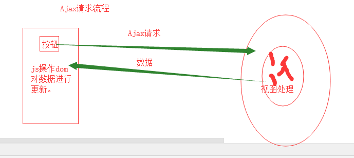
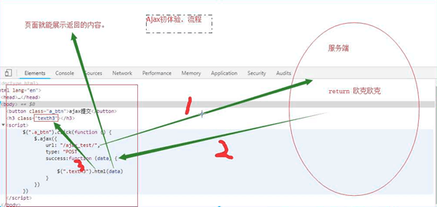
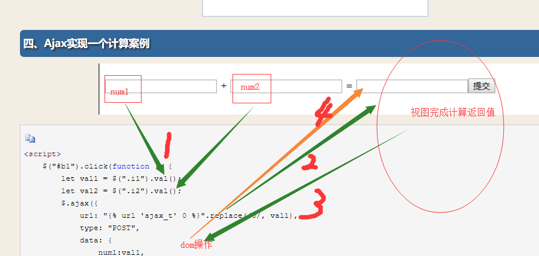
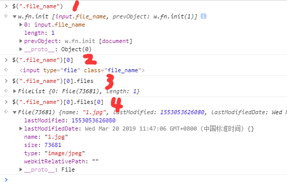
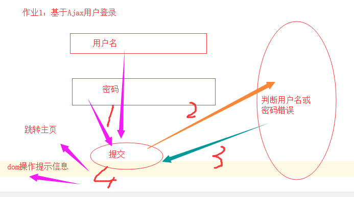

## day50 Ajax

### 一、内容回顾

#### 1. 聚合查询aggregate

​	聚合函数，查询结果。

#### 2. 分组查询annotate

​	分组查询，统计结果

#### 3. F查询

​	动态获取字段的值

#### 4. Q查询

​	or关键字

```python
models.Book.objects.filter(aaa="fdfd", bbb="dfdf")  # and
models.Book.objects.filter(Q(aaa="dfdf")|Q(bbb="dfdfd"))  # or
```


### 二、今日概要

博客园地址：https://www.cnblogs.com/Michael--chen/p/10560758.html

Ajax相关

 	1. 简介
 	2. 简单案例
 	3. 计算案例
 	4. 上传json文件
 	5. form表单和ajax上传文件


### 三、 今日详细

##### 一、简介

目前为止，能想服务器发送请求的方式有哪些？

1. 浏览器URL栏，输入URL，回车；

2. form表单；

3. 超链接标签a；

4. Ajax今日内容。

   Ajax请求流程：









form 表单使用注意事项：

1. input标签 type指定为file；
2. form标签属性指定为 enctype="multipart/form-data"；

视图注意事项：

1. 获取文件对象用request.FILES.get(filename) ；
2. request.post,只能获取文件名称。


Ajax上传文件

从input标签获取文件对象图



Ajax请求注意事项：

1. 先创建 new FormData() 对象（容器）；

2. 前端获取文件对象（参考上图）$(".file_name")[0].files[0]；

3. Ajax配置；

   ```js
   processData: false,  // 告诉jQuery不要去处理发送的数据
   contentType: false,  // 告诉jQuery不要去设置Content-Type请求头
   ```


### 四、今日作业

 1. 基于Ajax实现用户登录

    

 2. 基于Ajax实现图书的删除。


